## 2025 Fall

### Cornhole Table (FES-095)

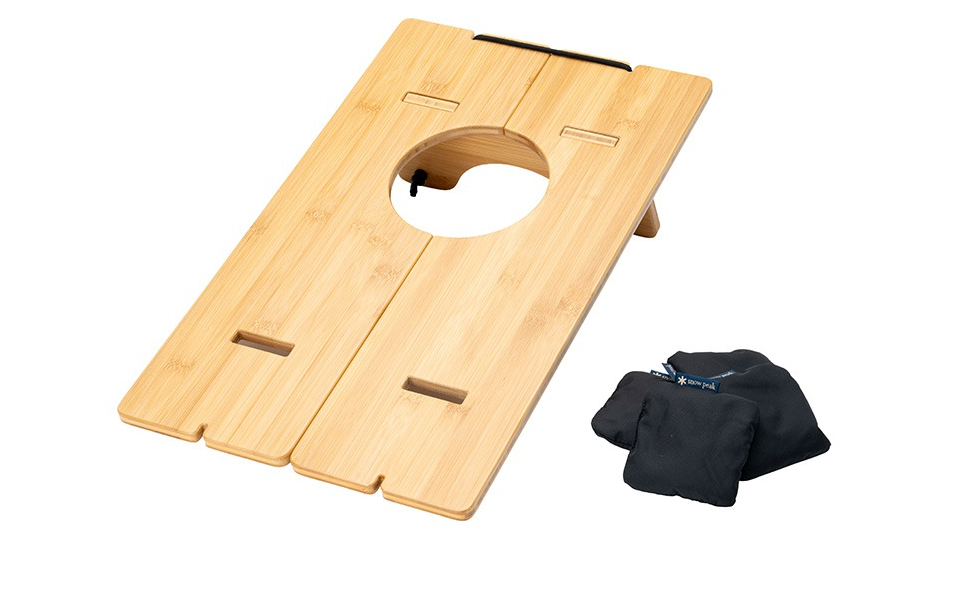

- Size: 500 x 300 x 115(h)mm
- Weight: 2kg
- Storage Size: 500 x 150 x 65(H)mm
- Contents:
  - Board Part x2
  - Leg Part x2
  - Ball x4
  - Carrying Case
- Materials:
  - Body: Laminated Bamboo
  - Cord: Latex
  - Ball: 210D Nylon, Polypropylene
  - Carrying Case: 420D Polyester

### Thermo Tumbler 360 Duo Set (FES-360-2)

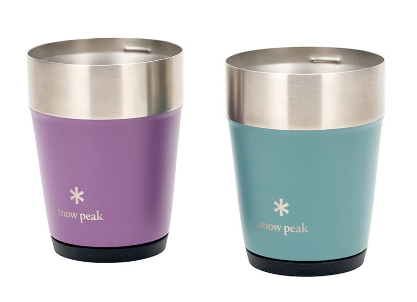

- Size: φ84 x 112mm
- Weight: 150g (per unit)
- Contents:
  - Body x2
  - Carrying Case
- Capacity: 360ml
- Materials:
  - Body: Stainless Steel (exterior Polyester coating)
  - Bottom Cover: Silicone Rubber

### Goro Dutch Incense (FES-370)

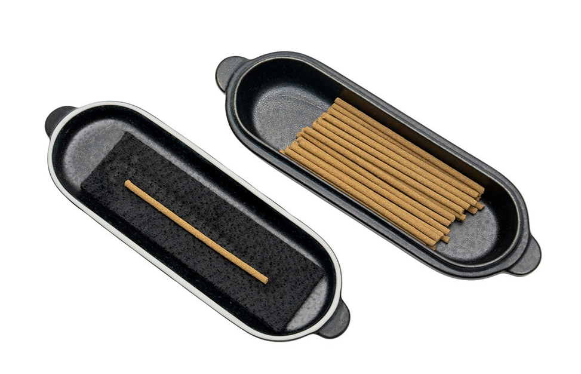

- Size: 147 x 47 x 36(H)mm
- Weight: 230g
- Contents:
  - Incense Box
  - Incense (30 pcs)
  - Fireproof Mat
  - String Belt
- Type: Woody Sandalwood
- Content Amount: 30 sticks
- Ingredients:
  - Tab Powder
  - Ginkgo Powder
  - Sandalwood
  - Fragrance
- Approx. Burn Time: approx. 20 min
- Materials:
  - Incense Case: Ceramic (pressure cast), Black Glaze
  - Fireproof Mat: Flame-Retardant Polyacrylonitrile Fiber
  - Strapping Belt: Polypropylene

### Mini Hozuki Shade Bird (FES-450)

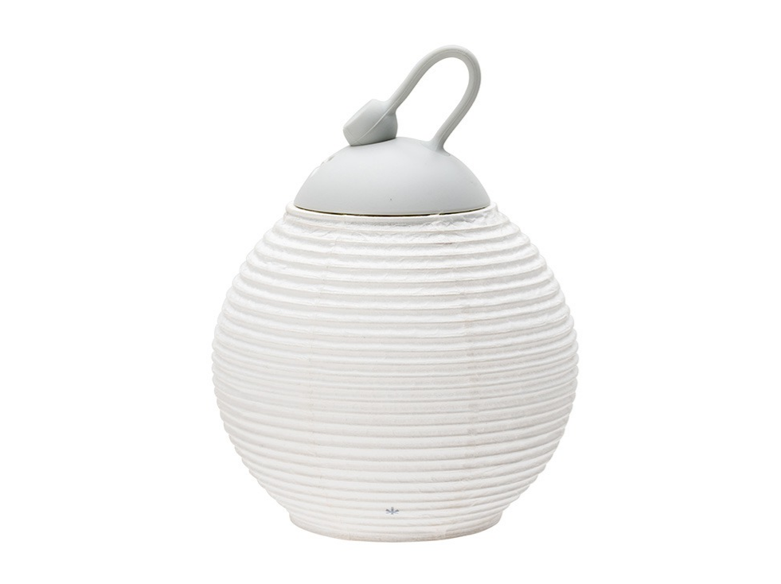

- Size: Φ107 x 90(h)mm
- Weight: 16g
- Storage Size: Φ107 x 15(h)mm (main unit only)
- Contents: Lantern Shade Body
- Materials:
  - Paper (water-repellent)
  - Steel

## 2025 Spring

### Folding Disc (FES-225)

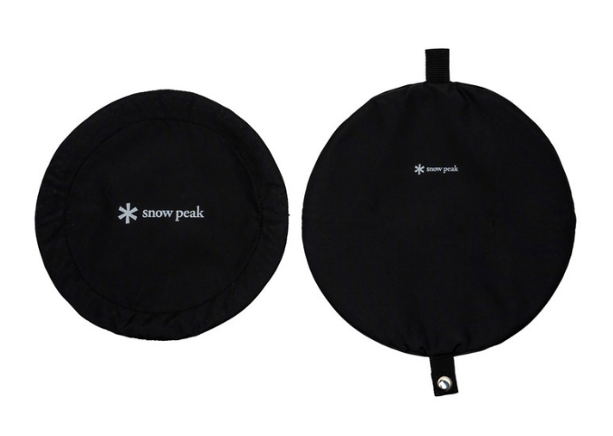

- Contents:
  - Body
  - Carrying Case
- Materials:
  - Nylon
  - Stainless Steel
- Size: ø230 x H10mm
- Weight: 80g
- Packed Size: 90 x 140 x 30mm

### Hozuki Shade BOTAN (FES-480)

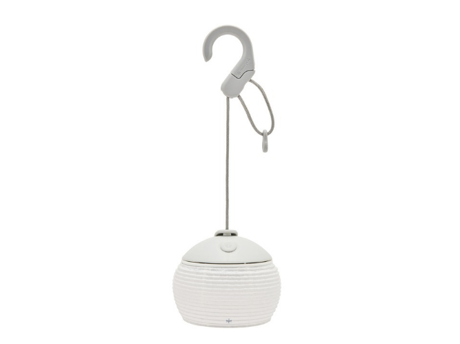

- Materials:
  - Kozo Paper (water-repellent)
  - Steel
- Size: ø110 x H62mm
- Weight: 25g
- Packed Size: 110 x 15mm

### Deep Backpacker's Cup (FES-382)

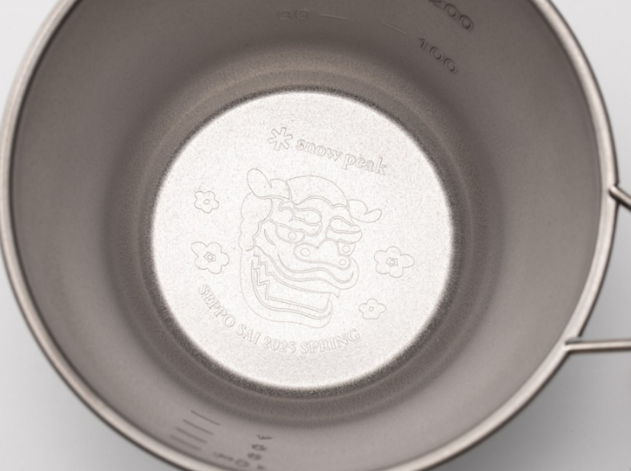

- Contents: Body
- Materials: Titanium
- Size: ø109 x H65mm
- Weight: 42g
- Lid not included

### Mosquito Coil Pig Mini Red (FES-087-1-RD)

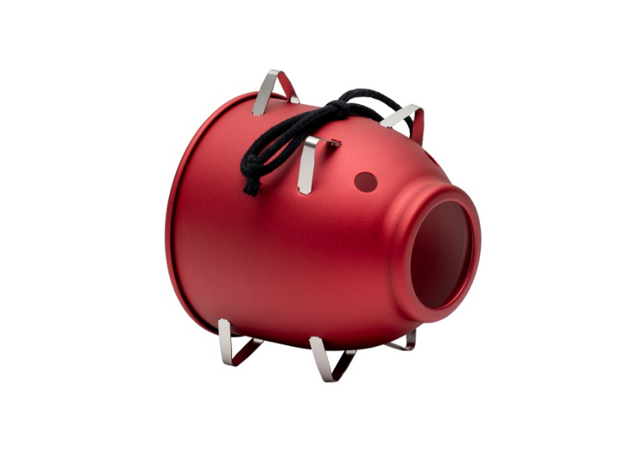

- Size: 95 x 96 x 107(h)mm
- Weight: 75g
- Materials:
  - Body: Aluminum
  - Legs, Ears & Tail Parts: Stainless Steel
  - Hanging Hardware: Stainless Steel
  - Hanging Strap: Cotton

### Mosquito Coil Pig Mini Black (FES-087-1-BK)

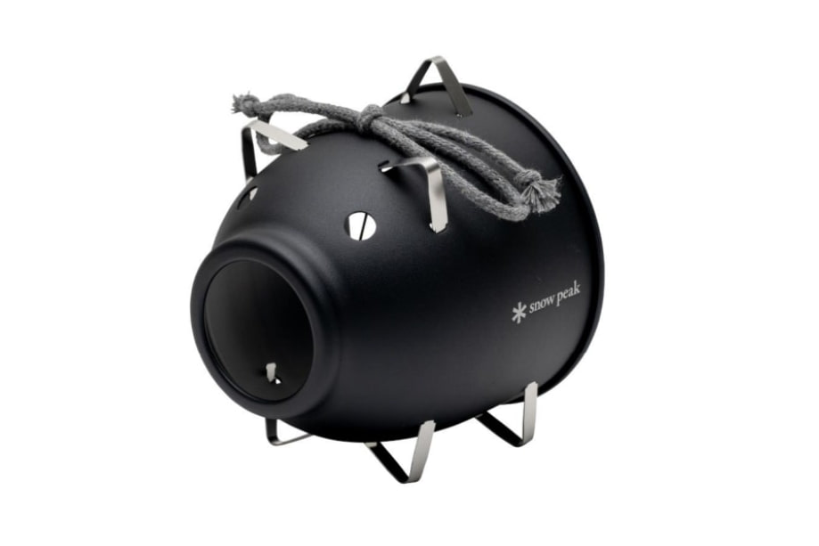

- Size: 95 x 96 x 107(h)mm
- Weight: 75g
- Materials:
  - Body: Aluminum
  - Legs, Ears & Tail Parts: Stainless Steel
  - Hanging Hardware: Stainless Steel
  - Hanging Strap: Cotton

## 2024 Fall

### Stainless 1-Unit Tray Black (FES-085-BK)

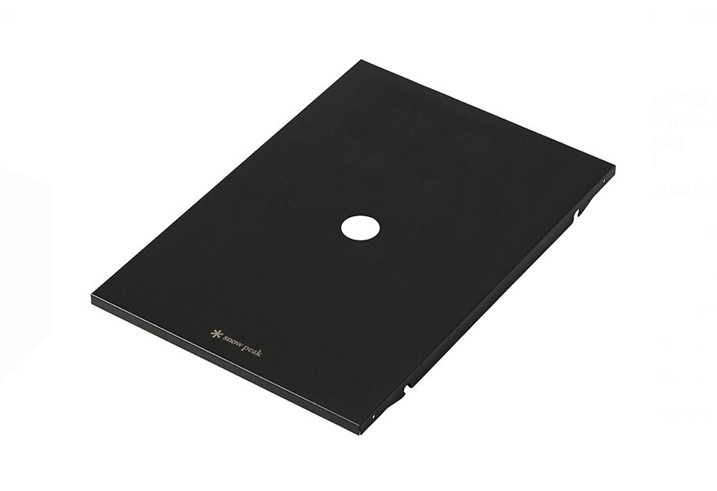

- Materials: Stainless Steel (heat-resistant coating)
- Size: 250 x 360 x 15(h)mm
- Weight: 635g

### Stainless Lid Tray Half Black (FES-086-BK)

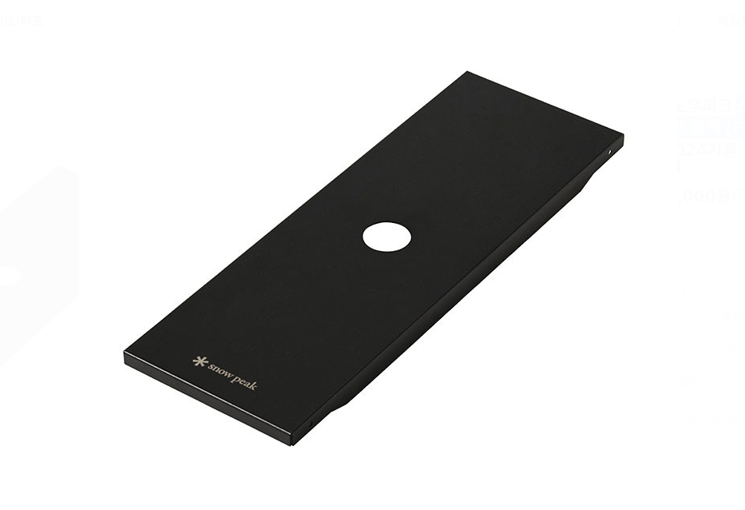

- Materials: Stainless Steel (heat-resistant coating)
- Size: 1250 x 360 x 15(h)mm
- Weight: 335g

### Snow Peak Land Lock Side Tarp Ivory (FES-270-IV)

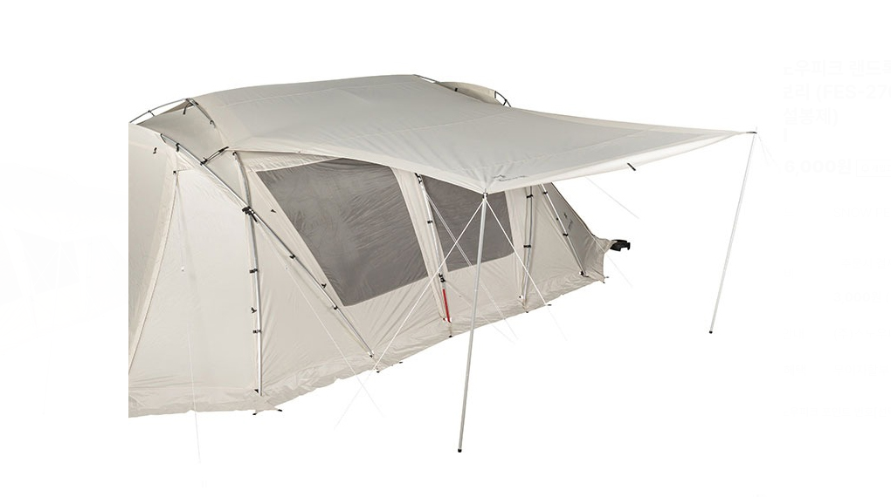

- Contents:
  - Tarp Body
  - Inner Roof
  - Stopper Rope (Y-type 10m x2, 3.5m x5)
  - Carrying Case
  - Inner Roof Case
  - Pole Case
  - Stake Case
- Materials:
  - Body: 210D Polyester Oxford, PU Coating, Hydrostatic Head 3,000mm, UV Protection, Teflon Water-Repellent
  - Inner Roof: 68D Polyester Taffeta
- Packed Size: 80 x 18 x 26(h)cm
- Weight: 3.9kg

### Titanium Mini Backpacker's Cup 2024 EDITION (FES-381)

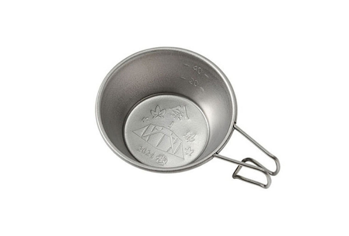

- Materials: Titanium
- Weight: 17g (0.6oz)
- Capacity: 60ml (2.0 fl oz)

### Kaen Set (FES-460)

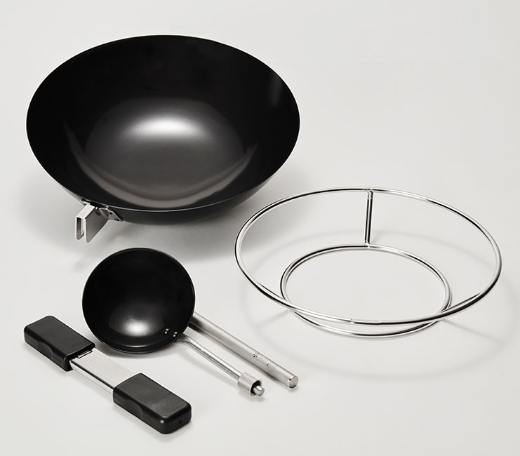

- Materials:
  - Kaen Wok: Iron (clear silicone coating), Stainless Steel
  - Handle: Stainless Steel
  - Protection Cap: Polyethylene
  - Kaen Ladle: Iron
  - Kaen Ladle Handle: Stainless Steel
  - Kaen Riveted Joint: Stainless Steel
  - Carrying Case: Nylon
  - Ladle Carrying Case: Polypropylene
  - Cushion Sheet: Polyester, Rayon
- Size:
- Kaen Wok / Inner Dimensions:
  - 297 x 88(h)mm, bottom thickness 1.0mm
  - Outer Dimensions: 299 x 89(h)mm
  - Full Capacity: 3.8L
  - Recommended Capacity: 1.0L
  - Kaen Ladle: 105 x 370mm
  - Kaen Riveted Joint: 260 x 255 x 50(h)mm
- Packed Size: 33 x 90(h)cm
- Weight: 2kg

## 2024 Spring

### Amenity Dome M TC (FES-160)

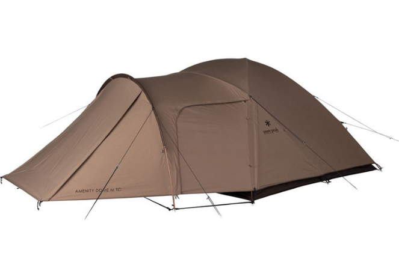

- Weight: 11kg
- Packed Size: 74 x 22 x 25(h)cm
- Set Contents:
  - Fly Sheet
  - Inner Tent
  - Cross Frame (x2)
  - Side Frame
  - Vestibule Frame
  - Duralumin Stake (17cm x18)
  - Stopper Rope (1.4m x2, 2.5m x2, Y-type 5m x2)
  - Repair Pipe
  - Carrying Case
  - Frame Case
  - Stake Case
- Materials:
  - Fly Sheet: 68D Polyester Taffeta
  - Floor: 210D Polyester Oxford, PU Coating, Hydrostatic Head 1,800mm min.
  - Frame: Duralumin A7001 (Φ12.8mm, Φ12mm, Φ11.8mm)
- Capacity: 3–5 persons
- Packed Size: 74 x 22 x 25(h)cm

### Kayad M Panel Cover Set (FES-400)

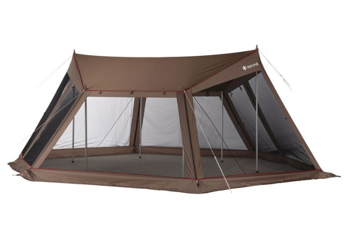

- Weight: 6.6kg
- Packed Size: 74 x 22 x 25(h)cm
- Set Contents:
  - Tarp Body
  - Vestibule Panel Cover A
  - Vestibule Panel Cover B
  - Side Panel Cover
  - Stopper Rope (Y-type 9m x2, 2.5m x4)
  - Carrying Case
  - Panel Cover Case
  - Pole Case
  - Stake Case
- Materials:
  - Roof: 150D Polyester Oxford, Light-Blocking Pigment PU Coating, Hydrostatic Head 3,000mm min., Teflon Water-Repellent, UV Protection
  - Wall, Skirt, Panel Cover: 68D Polyester Taffeta, PU Coating, Hydrostatic Head 1,000mm min.
- Case Size: 78 x 23 x 27(h)cm

### Thermo Tumbler 360 Duo Set (FES-360-1)

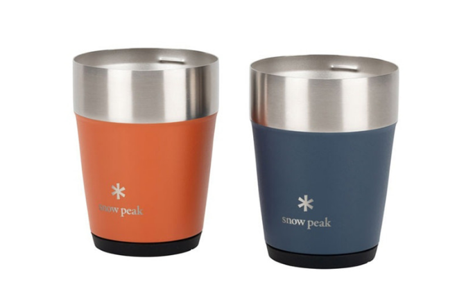

- Size: ø84 x 112mm
- Weight: 150g (per body unit)
- Set Contents:
  - Body x2
  - Carrying Case
- Materials:
  - Body: Stainless Steel (inner), Polyester Coating (outer)
  - Bottom Cover: Silicone Rubber
- Capacity: 360ml

### Titanium Mini Backpacker's Cup (FES-380)

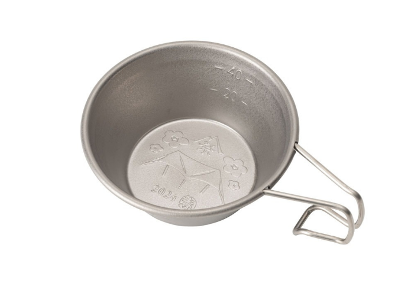

- Size: ø70 x 30mm
- Weight: 17g
- Set Contents: Body x1
- Materials: Titanium
- Full Capacity: 60ml

### Luxury Low Beach Chair Dark Green (FES-187)

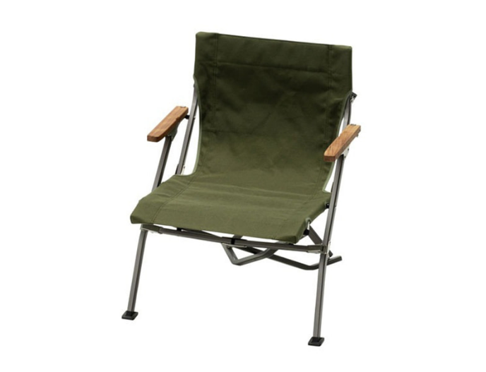

- Size: 580 x 650 x 690(h)mm (seat height 300mm)
- Weight: 150g (per body unit)
- Packed Size: 160 x 180 x 840(h)mm
- Set Contents:
  - Body
  - Carrying Case
- Materials:
  - Aluminum
  - Stainless Steel
  - Natural Wood (Teak)
  - Polyester

### Mini Mosquito Coil Pig Silver (FES-087-1)

- Size: 95 x 96 x 107(h)mm
- Weight: 75g
- Set Contents: Body
- Materials:
  - Body: Aluminum
  - Legs, Ears, Tail Parts: Stainless Steel
  - Metal Hook: Stainless Steel
  - Cord: Cotton

### Amenity Tarp TC Set (FES-851)

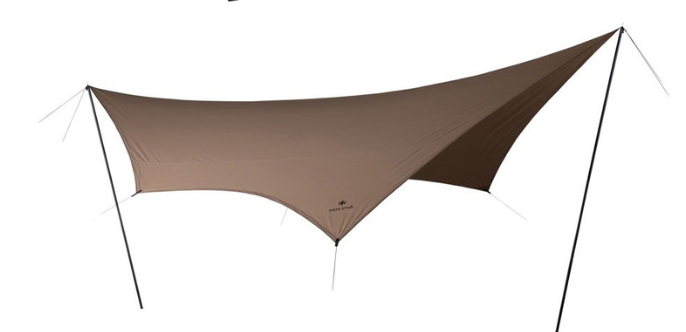

- Weight: 9.4kg
- Packed Size: 80 x 20 x 24(h)cm
- Set Contents:
  - Tarp Body
  - Steel Pole (280cm, 240cm)
  - Steel Stake (30cm x8)
  - Stopper Rope (Y-type 10m x2, 3m x2, 2m x2)
  - Connection Tape
  - Carrying Case
  - Pole Case
  - Stake Case
- Materials:
  - Tarp Body: Poly-Cotton Blended Fabric (Polyester approx. 65%, Cotton approx. 35%), Water-Repellent, Anti-Fungal
  - Pole, Stake: Steel

### Shelf Container 25 Stacking Lid (FES-045)

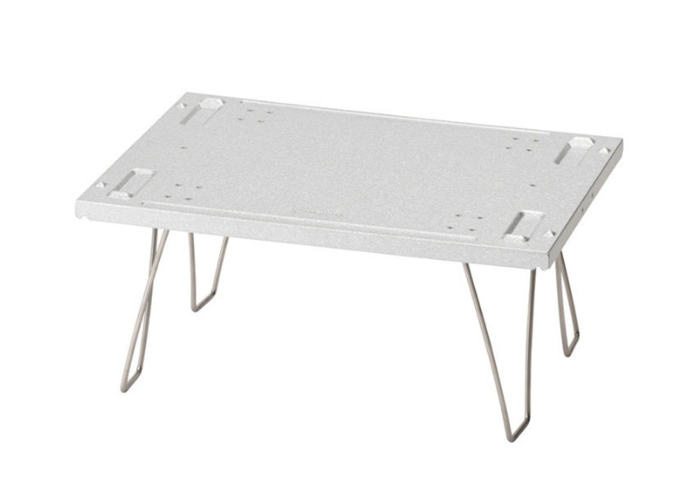

- Size: 310 x 440 x 209(h)mm
- Weight: 1.9kg
- Packed Size: 310 x 440 x 23(h)mm
- Set Contents: Body
- Materials:
  - Galvalume Steel Sheet
  - Stainless Steel

### Shelf Container 50 Olive (FES-038-OL)

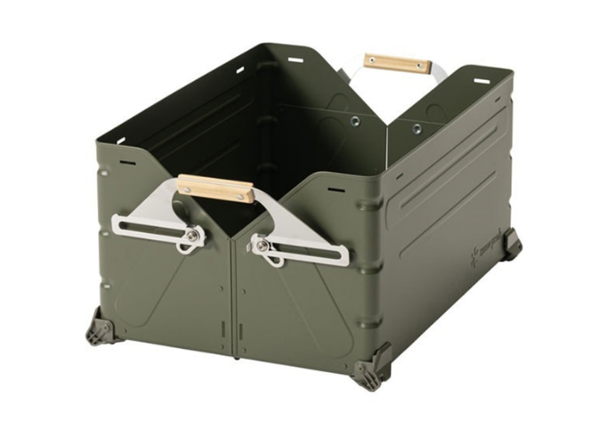

- Size: 625 x 405 x 270(h)mm
- Weight: 5.5kg
- Set Contents:
  - Body
  - User Guide
- Materials:
  - Body: Steel
  - Handle: Laminated Bamboo, Stainless Steel
  - Leg: Polycarbonate
- Internal Dimensions: 500 x 370 x 255(h)mm / 19.7 x 14.5 x 10(h)in

### Shelf Container 25 Olive (FES-037-OL)

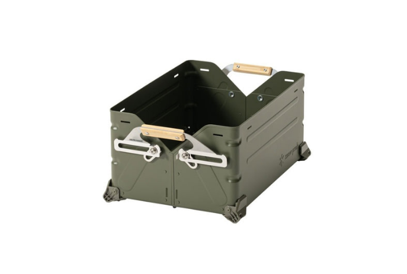

- Size: 520 x 325 x 210(h)mm
- Weight: 3.6kg
- Set Contents:
  - Body
  - User Guide
- Materials:
  - Body: Steel
  - Handle: Laminated Bamboo, Stainless Steel
  - Leg: Polycarbonate
- Internal Dimensions: 405 x 290 x 195(h)mm / 16 x 11.5 x 7.7(h)in

## 2023 Fall

### Compact Ofuton 700 (FES-105-2)

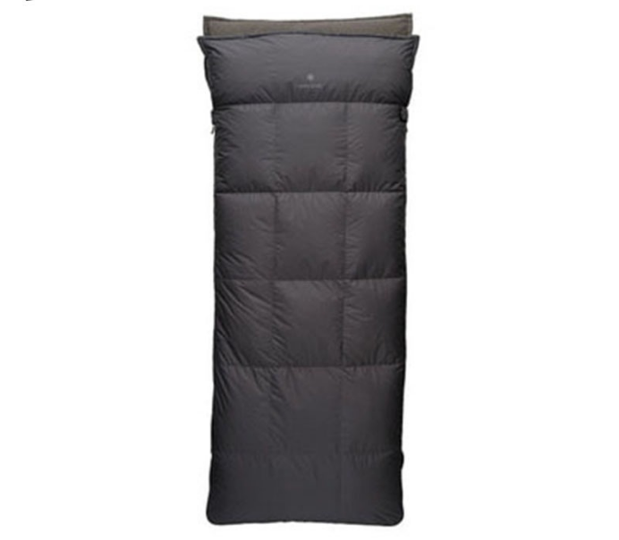

- Contents:
  - Body
  - Carrying Case
- Materials:
  - Outer Fabric, Carrying Case: High-Density Nylon Taffeta
  - Lining: Flannel
  - Fill: 800FP
- Size:
  - 75 x 200cm (mat)
  - 84 x 190cm (comforter)
- Packed Size: Φ22 x 44(h)cm
- Weight: 1.9kg
- Features:
  - Comfort Temp: 0°C
  - Lower Limit Temp: -5°C

### SS Single Plus Power (FES-105-3)

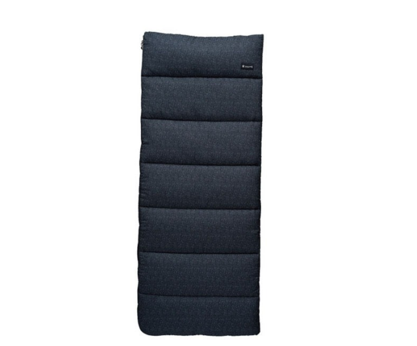

- Contents:
  - Body
  - Carrying Case
- Materials:
  - Outer Fabric, Lining: 68D Polyester
  - Fill: Polyester
- Size: 78 x 196cm (packed 60 x 40 x 26cm)
- Weight: 2.6kg
- Features:
  - Comfort Temp: 5°C
  - Lower Limit Temp: 0°C

### Penta Pro. Air 1 Penta Ease Set (FES-199)

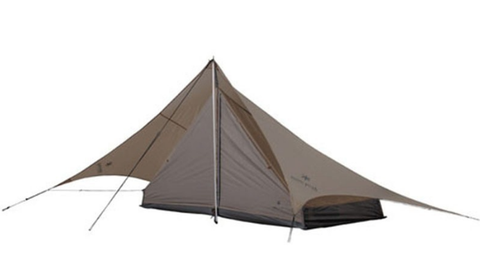

- Contents:
  - Tarp
  - Inner Room
  - Ground Sheet
  - Rain Cover
  - Duralumin V-Stake (x12)
  - Stopper Rope (3m x2, Y-type 6m x1)
  - Carrying Case
  - Tarp Case
  - Stake Case
- Materials:
  - Tarp: 20D Silicone Polyester Mini Ripstop, PU Coating, Hydrostatic Head 1,500mm min.
  - Vestibule Door Panel: 20D Silicone Polyester Mini Ripstop
  - Inner Wall: 30D Nylon Ripstop, PU Coating, Hydrostatic Head 1,500mm min.
  - Rain Cover: 20D Silicone Polyester Mini Ripstop, PU Coating, Hydrostatic Head 1,500mm min.
- Packed Size: 25 x 13 x 35(h)cm
- Weight: 1.24kg (excl. rain cover, ground sheet, stakes, rope)

### Land Lock Pro. Air Shield Roof Set (FES-197)

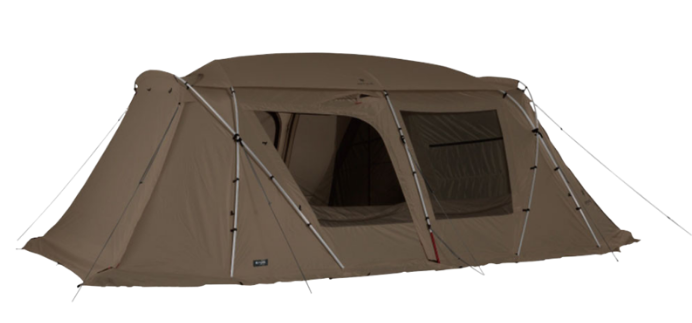

- Contents:
  - Shelter Body
  - Shield Roof
  - Inner Room
  - A-Frame (x2)
  - C-Frame (x2)
  - Center Frame
  - Ridge Pole
  - Stopper Rope (1.5m x2, 2.5m x4, 3.5m x6)
  - Carrying Case
  - Frame Case
  - Stake Case
  - Compression Belt
- Materials:
  - Body Roof: 75D Silicone Polyester Ripstop, Light-Blocking Pigment PU Coating, Hydrostatic Head 1,500mm min.
  - Wall: 75D Silicone Polyester Ripstop, PU Coating, Hydrostatic Head 1,500mm min.
  - Shield Roof: 75D Silicone Polyester Ripstop, Light-Blocking Pigment PU Coating, Hydrostatic Head 1,500mm min.
  - Frame: A6061
  - Inner Room: 20D Polyester Mini Ripstop (wall), 40D Polyester Mini Ripstop, PU Coating, Hydrostatic Head 1,800mm min. (floor)
- Packed Size: 74 x 30 x 35(h)cm
- Weight: 20.7kg (incl. shield roof)

### Hexa Connector Tarp Pro. Air 2023 Fall FES (FES-255)

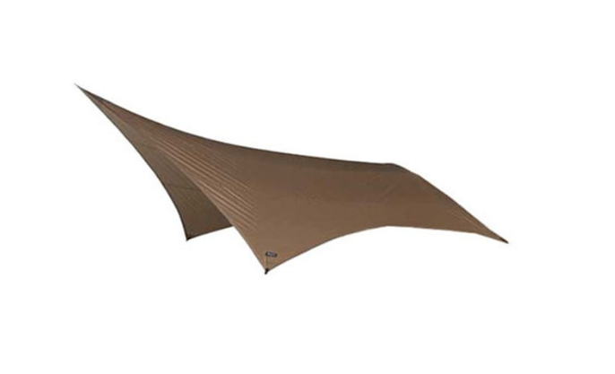

- Contents:
  - Tarp Body
  - Stopper Rope (Y-type 10m x1, 4m x2, 3m x2)
  - Frame Connector Stopper Rope x2
  - Carrying Case
  - Pole Case
  - Stake Case
- Materials: Body: 75D Silicone Polyester Ripstop, Light-Blocking Pigment PU Coating, Hydrostatic Head 1,500mm min.
- Packed Size: 80 x 17 x 23(h)cm
- Weight: 2kg

### Mini Flame 2023 EDITION (FES-147)

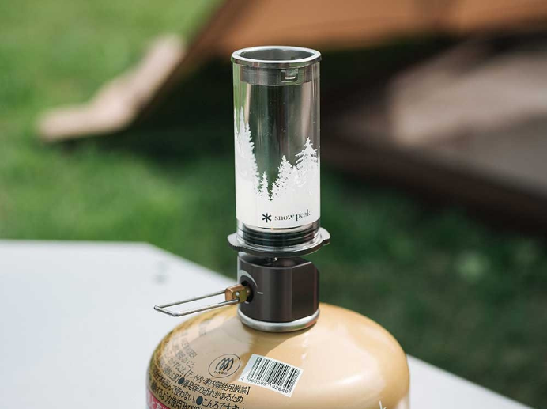

- Contents:
  - Body
  - Carrying Case
- Materials:
  - Body: Aluminum Alloy, Brass, Rubber, Glass, Stainless Steel
  - Carrying Case: Polyethylene
- Size: 42 x 40 x 105(h)mm
- Weight: 102g
- Gas Consumption: 7g/h

### Seppouen Grill Burner Oden Hotpot (FES-357)

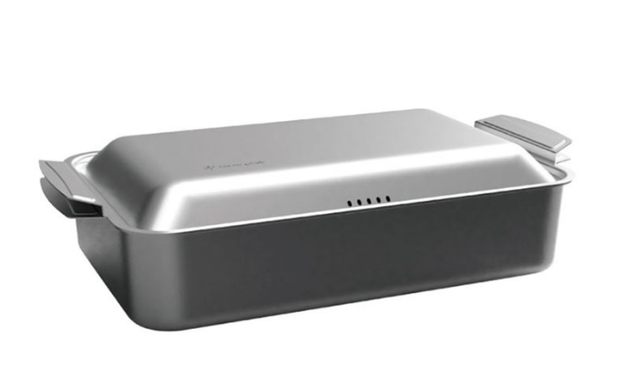

- Contents:
  - Pot
  - Lid
  - Partition Plate
  - Inner Tray
  - Carrying Case
- Materials:
  - Pot, Lid, Partition Plate, Inner Tray: Stainless Steel
  - Carrying Case: Polyester
- Body Size: 443 x 242 x 112(h)mm
- Weight: 2.6kg (incl. carrying case)
- Full Capacity: 6.7L
- Recommended Capacity: 4.6L

### Jikaro Table 2-Unit Bridge FES (FES-042)

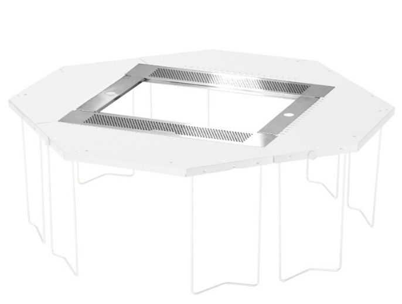

- Contents:
  - Body
  - Carrying Case
- Materials:
  - Body: Stainless Steel
  - Carrying Case: Polyester
- Size: assembled 600 x 645 x 30(h)mm / packed 645 x 160 x 30(h)mm
- Weight: 1.9kg

### Living Sheet Hexa Mat Set (FES-198)

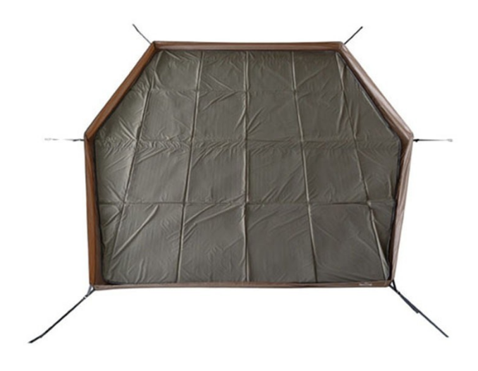

- Materials:
  - Living Sheet: 210D Polyester Oxford, PU Coating, Hydrostatic Head 1,800mm min.
  - Floor Mat: 68D Polyester Taffeta, PU Coating (outer), PVC (inner), PE 5mm (fill)
  - Carrying Case, Stake Case: Polyester
- Size: 345 x 315 x 13(h)cm
- Packed Size: 80 x 63 x 20(h)cm
- Weight: 6.6kg

## 2023 Spring

### Land Breeze Pro. Air DUO (FES-652)

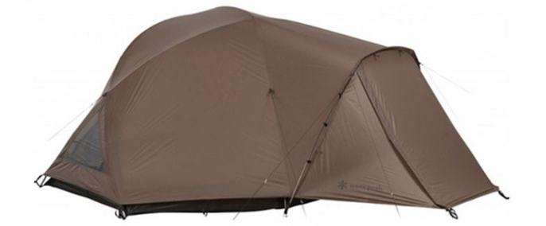

- Contents:
  - Fly Sheet
  - Inner Tent
  - Ground Sheet
  - Double Cross Frame (x2)
  - Center Frame (x1)
  - Vestibule Frame (x1)
  - Duralumin Stake (17cm x16)
  - Stopper Rope (2-person 4m x2, 2m x4)
  - Repair Pipe
  - Carrying Case
  - Frame Case
  - Stake Case
- Materials:
  - Fly Sheet: 20D Silicone Polyester Mini Ripstop, PU Coating, Hydrostatic Head 1,500mm min.
  - Inner Wall: 20D Polyester Mini Ripstop
  - Floor, Ground Sheet: 40D Nylon Ripstop, PU Coating, Hydrostatic Head 1,500mm min.
  - Frame: Duralumin A7001 (Φ11mm)
- Packed Size: 61 x 19 x 23(h)cm
- Weight: 4.7kg
- Capacity: 2–3 persons

### Elfield Hexa Pro. Air (FES-330)

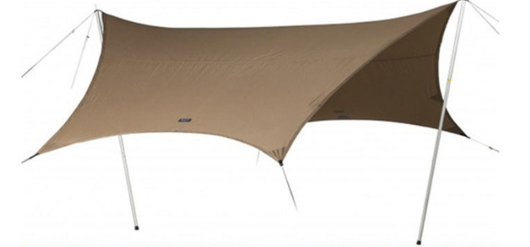

- Contents:
  - Tarp Body
  - Stopper Rope (Y-type)
- Packed Size: 170 x 800 x 240(h)mm
- Weight: 1.7kg

### Shelf Container 50 Black (FES-038-BK)

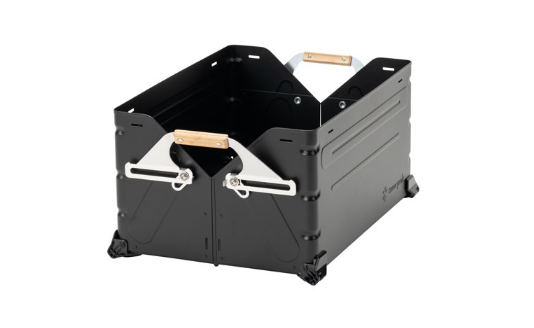

- Materials:
  - Body: Steel
  - Handle: Laminated Bamboo, Stainless Steel
  - Leg: Polycarbonate

### Shelf Container 25 Black (FES-037-BK)

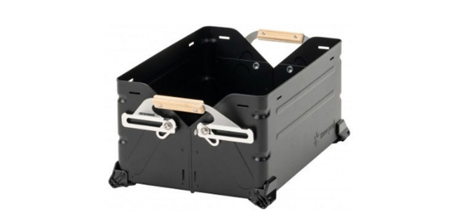

- Materials:
  - Body: Steel
  - Handle: Laminated Bamboo, Stainless Steel
  - Leg: Polycarbonate
- Size: 520 x 325 x 210(h)mm
- Packed Size: 520 x 325 x 210(h)mm
- Weight: 3.6kg

### IGT Single Table Bamboo Light (FES-218)

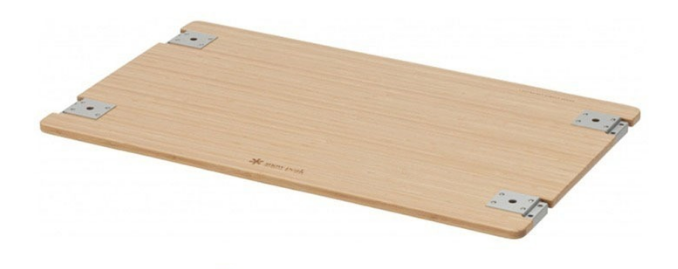

- Size: 846 x 496 x 25(h)mm
- Weight: 2.9kg
- Materials:
  - Laminated Bamboo
  - Metal (Aluminum Alloy)
  - Polypropylene

### High Tension Cot Black (FES-029)

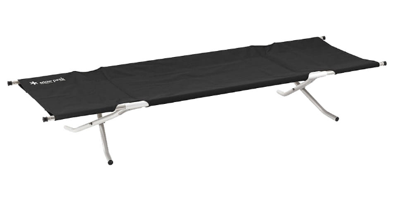

- Contents:
  - Body
  - Carrying Case
- Materials:
  - Body Frame: Aluminum
  - Side Frame: Stainless Steel
  - Fabric: 600D Polyester, PVC Processing
  - Pocket: Polyester, Nylon, Polyurethane
  - Carrying Case: 600D Polyester, PVC Processing
- Size: 2,000 x 650 x 320(h)mm
- Packed Size: 1,250 x 165 x 145(h)mm
- Weight: 7.3kg

### Mosquito Coil Pig Red (FES-087-RD)

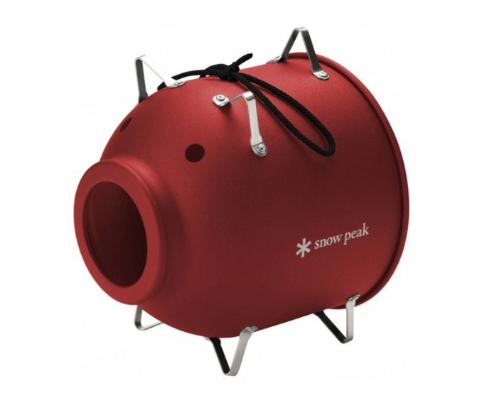

- Contents:
  - Body
  - Mesh Case
- Materials:
  - Body: Aluminum
  - Legs, Ears, Tail Parts: Stainless Steel
  - Clasp Attachment: Stainless Steel
  - Cord: Cotton
- Size: 137 x 148 x 165(h)mm
- Weight: 150g

### Mesh Luxury Low Beach Chair (FES-186)

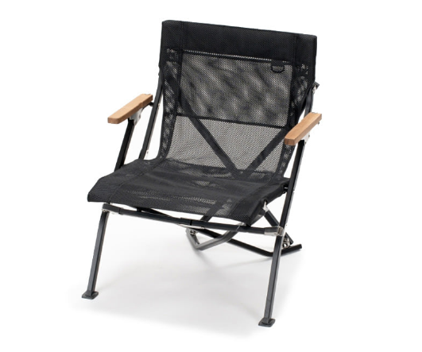

- Contents:
  - Body
  - Carrying Case
- Materials:
  - Aluminum
  - Stainless Steel
  - Natural Wood (Teak)
  - Polyester
- Size: 580 x 650 x 690(h)mm (seat height 300mm)
- Packed Size: 160 x 180 x 840(h)mm
- Weight: 3.7kg

### Tarp Extension 4 (FES-433)

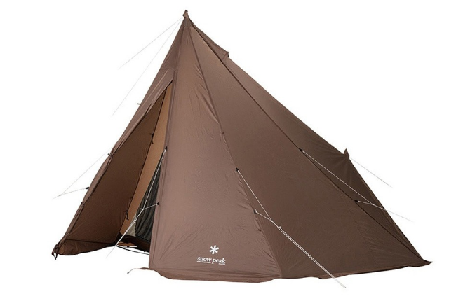

- Contents:
  - Fly Sheet
  - Inner Tent
  - Ground Sheet
  - Sub Pole (x1)
  - Stopper Rope (Y-type 10m x1, Y-type 5m x1, 2.5m x6)
  - Carrying Case
  - Duralumin Stake (x18)
  - Stake Case
  - Seam Grip
- Materials:
  - Fly Sheet: 75D Polyester Taffeta, PU Coating, Hydrostatic Head 1,800mm min., Teflon Water-Repellent, UV Protection
  - Inner Tent: 68D Polyester Taffeta (wall), 210D Polyester Oxford, PU Coating, Hydrostatic Head 1,800mm min. (floor)
  - Ground Sheet: 210D Polyester Oxford, PU Coating, Hydrostatic Head 1,800mm min.
- Size: 325 x 400 x 280(h)cm
- Packed Size: 23 x 69 x 25(h)cm

## 2022 Fall

### Jikaro Table Black (FES-011)

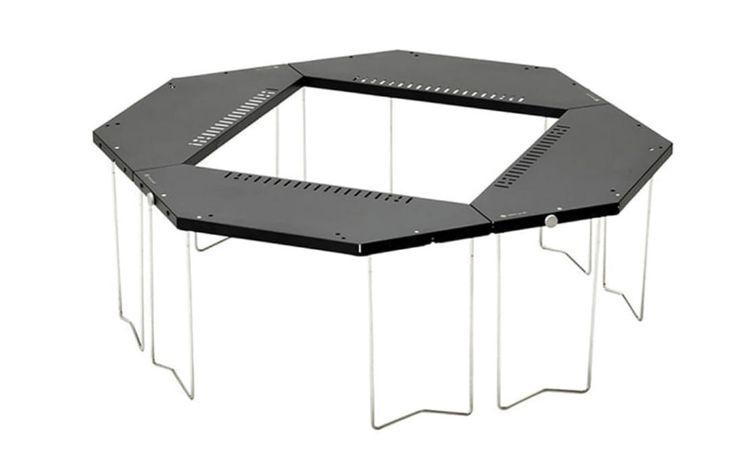

- Size: 1,120 x 1,120 x 400(h)mm (opening/600 x 600mm) / 890 x 890 x 400(h)mm (opening/370 x 370mm)
- Packed Size: 745 x 170 x 400mm
- Contents:
  - Body
  - Carrying Case
- Materials:
  - Tabletop: Stainless Steel (heat-resistant coating)
  - Leg Section: Stainless Steel
  - Handle: Aluminum Alloy
- Weight: 10.8kg

### Thermo Tumbler Duo Set 2022 EDITION (FES-470)

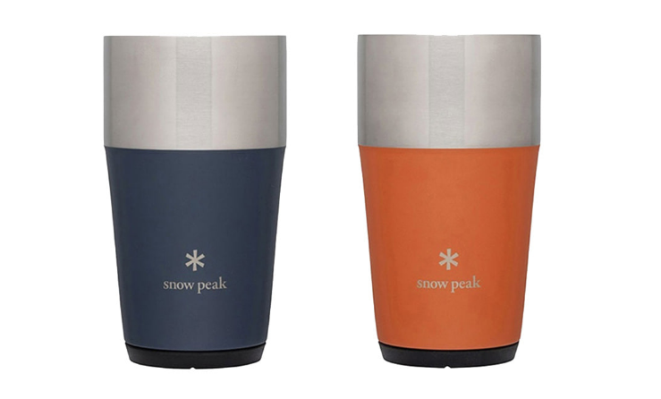

- Size: Φ84 x 150mm
- Weight: 215g (per body unit)
- Packed Size: 130 x 32 x 18(h)mm
- Materials:
  - Body: Stainless Steel (outer Polyester coating)
  - Bottom Cover: Silicone Rubber

### Mini Flame 2022 EDITION (FES-146)

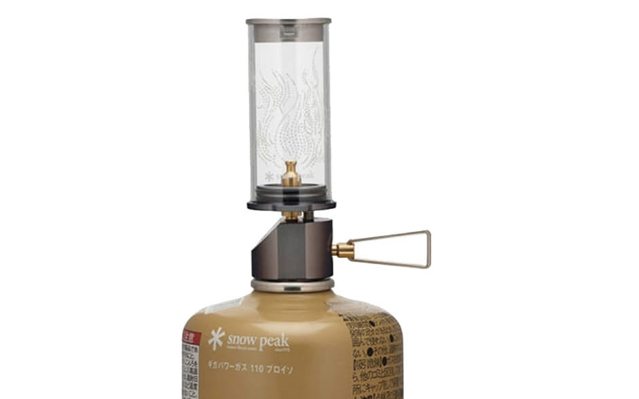

- Size: 42 x 40 x 105(h)mm
- Weight: 102g
- Materials:
  - Aluminum Alloy
  - Brass
  - Rubber
  - Glass
  - Stainless Steel

### Connect Tarp Hexa Ivory (FES-275)

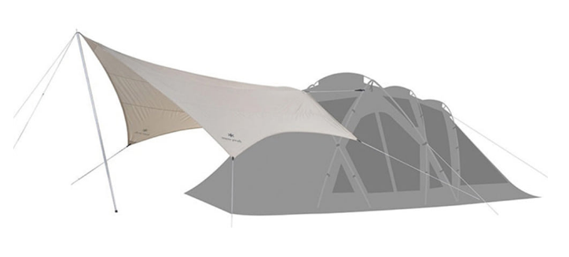

- Contents:
  - Tarp Body
  - Y-Type Stopper Rope (x1)
  - Stopper Rope (x4)
  - Frame Mounting Stopper Rope (x2)
  - Carry Bag
  - Pole Case
  - Stake Case
- Materials: Body: 210D Polyester Oxford, PU Coating, Hydrostatic Head 1,800mm min., Teflon Water-Repellent, UV Protection
- Weight: 2.5kg
- Note: Basic setup requires separately sold 280cm Wing Pole x1 and Stakes x6.

### Folding Santoku Knife (FES-220)

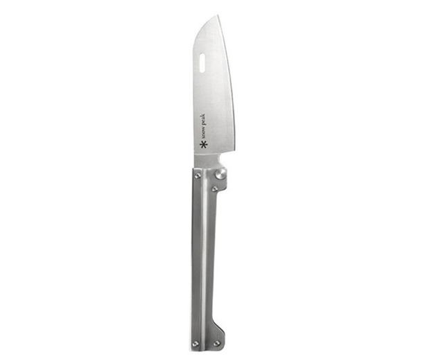

- Size: 240 x 30 x 18(h)mm
- Packed Size: 130 x 32 x 18(h)mm
- Weight: 125g
- Materials: Stainless Steel
- Notes: Recalled due to manufacturing defect

### Mini Hozuki Sukio (FES-441-NV)

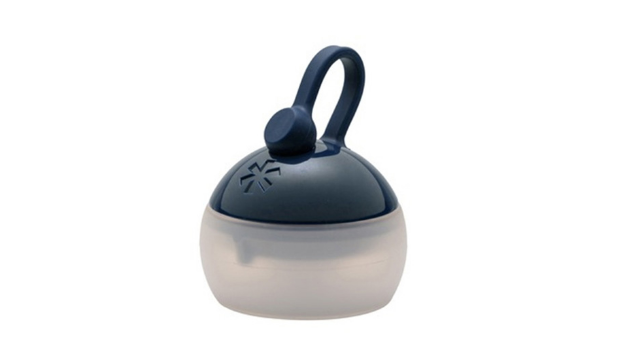

- Materials:
  - Body: Polycarbonate Resin, ABS Resin
  - Shade: Silicone Rubber
  - Lens Cover: PMMA Resin
- Size: ø62 x 75(h)mm
- Power Source: AAA Alkaline Battery (LR03) x3
- Continuous Light Time: Hi-60hrs / Low-100hrs
- Operating Temp: 0–35°C
- Brightness: 60 lumen
- Waterproof Rating: IPX4
- Lighting Mode: 3 modes (Hi-Low/Strobe/Simulated Flickering) + Stepless Dimming
- Light Color: Warm White
- Weight: 57g (excl. battery)

### Mini Hozuki Tanebi (FES-441-OR)

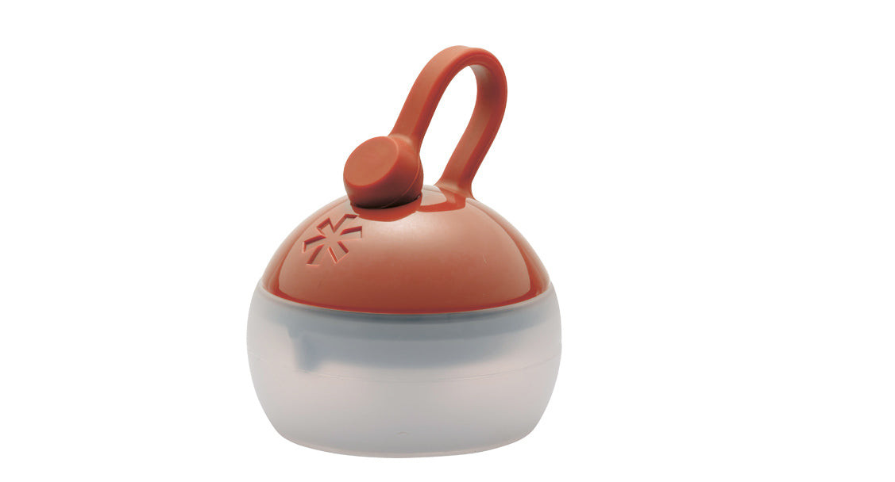

- Materials:
  - Body: Polycarbonate Resin, ABS Resin
  - Shade: Silicone Rubber
  - Lens Cover: PMMA Resin
- Size: ø62 x 75(h)mm
- Power Source: AAA Alkaline Battery (LR03) x3
- Continuous Light Time: Hi-60hrs / Low-100hrs
- Operating Temp: 0–35°C
- Brightness: 60 lumen
- Waterproof Rating: IPX4
- Lighting Mode: 3 modes (Hi-Low/Strobe/Simulated Flickering) + Stepless Dimming
- Light Color: Warm White
- Weight: 57g (excl. battery)

### Mini Backpacker's Cup 2022 AUTUMN EDITION (FES-176)

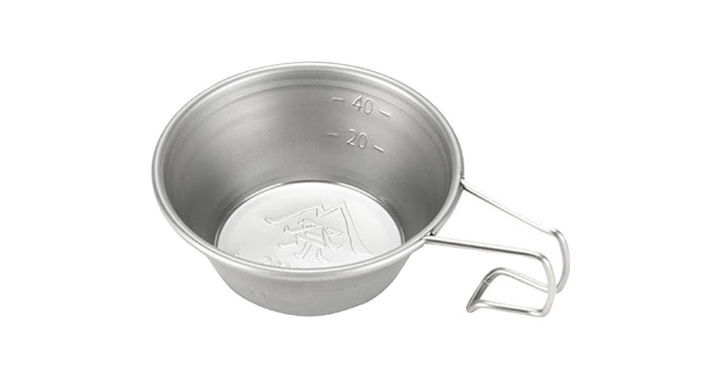

- Size: 70 x 70 x 30mm
- Weight: 30g
- Capacity: 60ml
- Materials: Stainless Steel

### Land Lock M Set Ivory (FES-195)

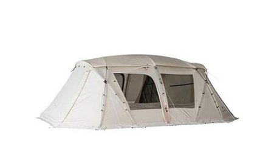

- Size: W590 x D350 x H205cm
- Weight:
  - Body/23kg
  - Inner Mat/3kg
  - Ground Sheet/1kg
- Packed Size:
  - Body Case/76 x 32 x 36cm
  - Frame Case/72 x 17 x 22cm
- Materials:
  - Body (roof): 150D Polyester Oxford, PU Coating, Hydrostatic Head 1,800mm min., UV Protection, Teflon Water-Repellent
  - Body (wall): 150D Polyester Oxford, PU Coating, Hydrostatic Head 1,800mm min., UV Protection, Teflon Water-Repellent
  - Frame: A6061 (φ19mm, 16mm)
  - Stake: Duralumin
  - Inner Room (wall): 68D Polyester Taffeta
  - Inner Room (bottom): 210D Polyester Oxford, PU Coating, Hydrostatic Head 1,800mm min.
  - Roof Sheet: 75D Polyester Taffeta, PU Coating, Hydrostatic Head 1,800mm min., UV Protection, Teflon Water-Repellent
- Inner Mat Surface Fabric:
  - 68D Polyester Taffeta, PU Coating
  - Core: 5mm Urethane
- Lining: PVC
- Ground Sheet: 210D Polyester Oxford, PU Coating, Hydrostatic Head 1,800mm min.

## 2022 Spring

### Tarp Extension Tent 4 Ivory (FES-432)

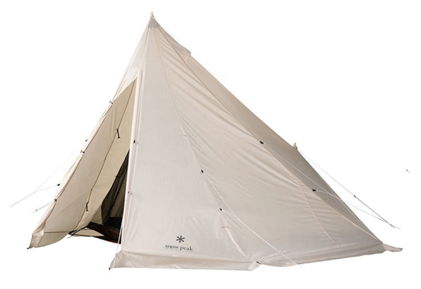

- Weight: 7.5kg
- Packed Size: 69 x 23 x 25cm
- Contents:
  - Fly Sheet
  - Inner Tent
  - Ground Sheet
  - Sub Pole (x1)
  - Stopper Rope (Y-type 10m x1, Y-type 5m x1, 2.5m x6)
  - Carry Bag
  - Duralumin Stake (x18)
  - Stake Case
  - Seam Grip
- Capacity: 4 persons
- Materials:
  - Fly Sheet: 75D Polyester Oxford, PU Coating, Hydrostatic Head 1,800mm min., Teflon Water-Repellent, UV Protection
  - Inner Tent: 68D Polyester Taffeta (wall), 210D Polyester Oxford, PU Coating, Hydrostatic Head 1,800mm min. (floor)
  - Ground Sheet: 210D Polyester Oxford, PU Coating, Hydrostatic Head 1,800mm min.

### Luxury Low Beach Chair Black (FES-193)

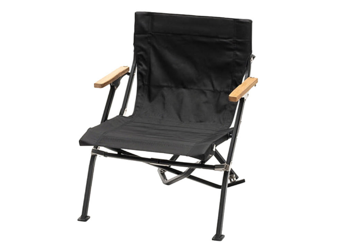

- Size: 58 x 65 x 69(h)cm
- Weight: 3.4kg
- Packed Size: 160 x 180 x 840(h)mm
- Materials:
  - Aluminum
  - Natural Wood (Teak)
  - Stainless Steel
  - 1680D Nylon
  - Polyester
  - Strap Belt: Cotton, Polyester

### Titanium Straw Set Blue & Green (FES-222-1)

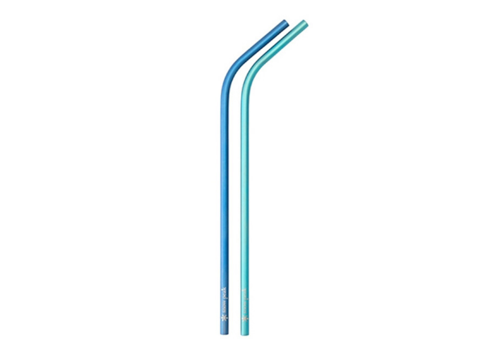

- Size: Φ6.4 x 230mm
- Weight: 22g (11g each)
- Contents: Straw Body x2 (Blue & Green)
- Materials: Titanium

### Titanium Straw Set Pink & Purple (FES-222-2)

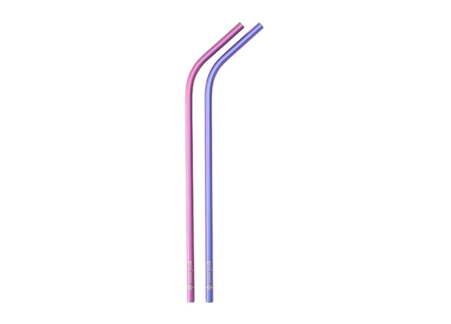

- Size: Φ6.4 x 230mm
- Weight: 22g (11g each)
- Contents: Straw Body x2 (Pink & Purple)
- Materials: Titanium

### IGT Two-Unit Low Style Set Black (FES-153)

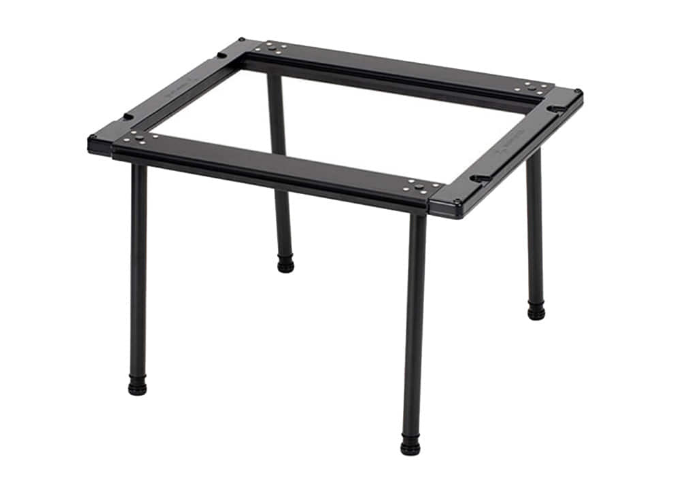

- Size:
- Frame: 596 x 496 x 30mm
- Leg: Φ25 x 410mm
- Weight: 3.5kg
- Materials:
  - Aluminum Alloy (Anodized)
  - Stainless Steel

### Takibi My Table Black (FES-039)

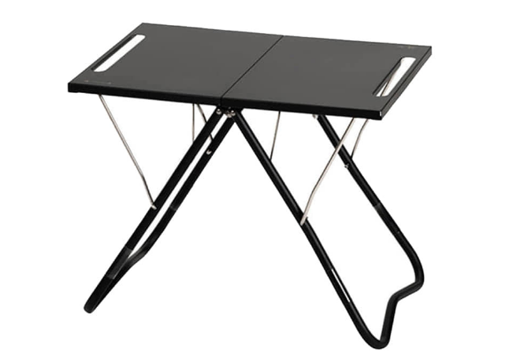

- Usage Size: 496 x 332 x 400mm
- Packed Size: 450 x 332 x 78mm
- Weight: 2.9kg
- Materials:
  - Stainless Steel (tabletop)
  - Aluminum Alloy (stand)
  - Polyester (cover)

### IGT Bamboo Extension Table Short (FES-217)

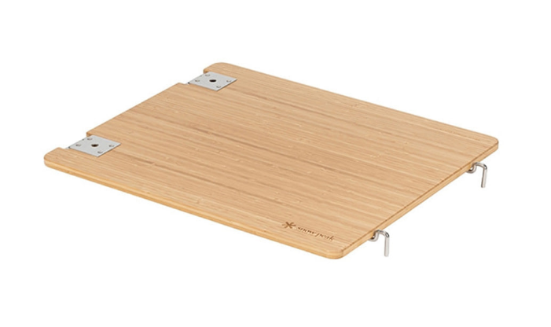

- Size: 596 x 496 x 25mm
- Weight: 2.2kg
- Contents:
  - Body
  - Rail Joint x2
- Materials:
  - Laminated Bamboo
  - Aluminum
  - Stainless Steel
  - Polypropylene

### IGT Two-Unit Storage Case (FES-246)

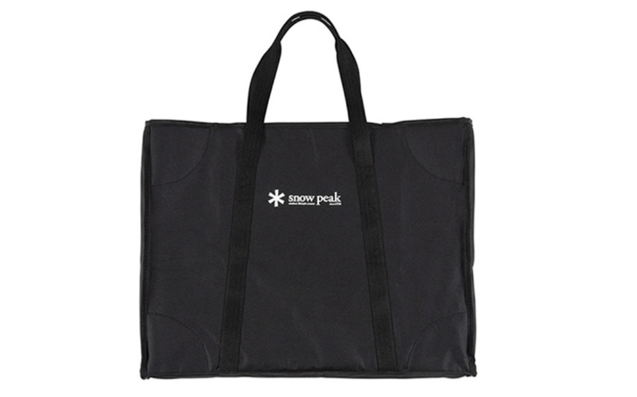

- Size: 680 x 135 x 525(h)mm
- Weight: 750g
- Materials: Polyester (PVC Processing)

### Titanium Spork Rainbow (FES-404)

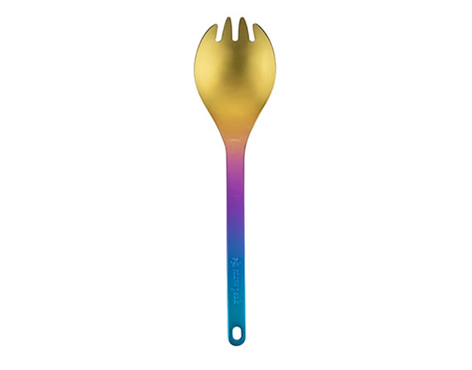

- Size: 40 x 165mm
- Weight: 16g
- Materials: Titanium

### Mini Backpacker's Cup 2022 SPRING EDITION (FES-175)

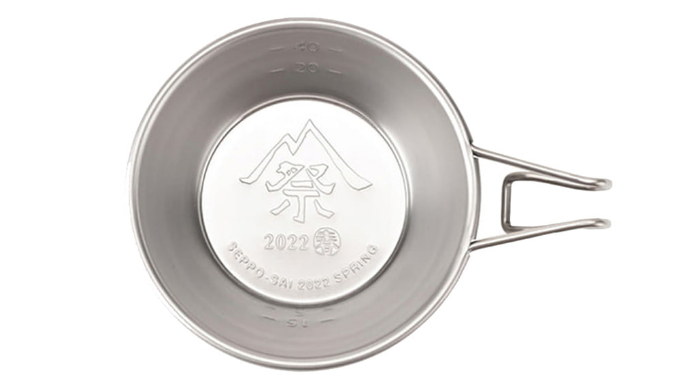

- Size: Φ70 x 30mm
- Weight: 30g
- Materials: Stainless Steel
- Max Capacity: 60ml

## 2021 Fall

### Land Lock Pro. Red Frame Edition (FES-091)

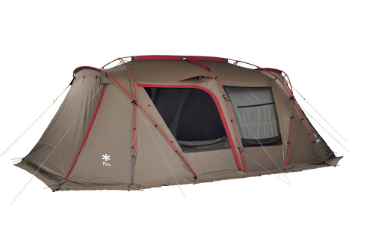

- Materials:
  - Roof: 210D Polyester Ripstop
  - Wall: 210D Polyester Ripstop
  - Mud Skirt: 210D Polyester Oxford
  - Inner Wall: 68D Polyester Taffeta
  - Bottom: 210D Polyester Oxford
  - Tent Pole: A6061 (φ19mm+φ22mm)
- Hydrostatic Head:
  - Roof: 3,000mm min.
  - Wall: 1,800mm min.
  - Bottom: 1,800mm min.
- Specs: Light-Blocking Pigment PU Coating, UV Protection, Teflon Water-Repellent
- Size: 720 x 1215 x 660(h)mm
- Weight: 13kg
- Packed Size: 360 x 1,215 x 90mm
- Contents:
  - Body
  - Carrying Bag
- Materials:
  - Tabletop: Laminated Bamboo
  - Stand: Aluminum Alloy (Anodized)
  - Case: Polyester

### One Action Table Long Bamboo Black (FES-139)

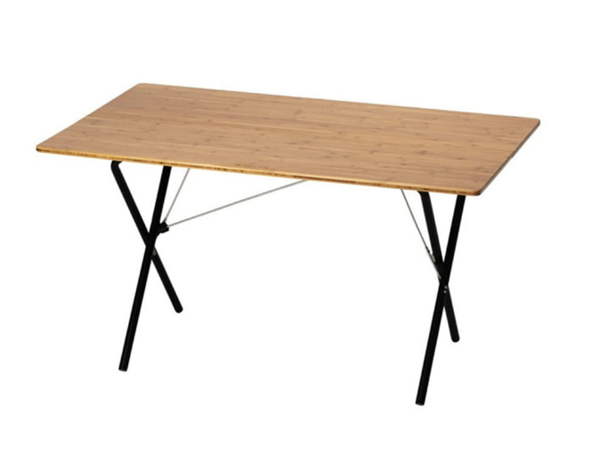

* Size: 720 x 1215 x 660(h)mm
* Weight: 13kg
* Packed Size: 360 x 1,215 x 90mm
* Contents: Body, Carrying Bag
* Materials:
  - Tabletop: Laminated Bamboo
  - Stand: Aluminum Alloy (Anodized)
  - Case: Polyester

### Wabuki Chopsticks Black (FES-124)

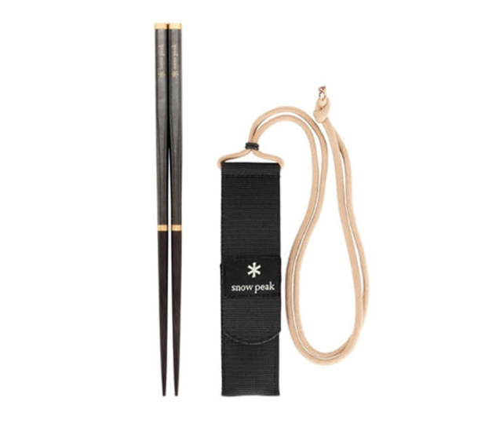

- Size:
  - 8 x 8 x 225mm (packed 122mm)
  - Case: 38 x 143mm
- Weight:
  - Body: approx. 32g
  - Case: approx. 17g
- Materials:
  - Stainless Steel (oxidation coloring)
  - Wood
  - Ebony
  - Brass
  - Polypropylene

### Mini Flame 2021 EDITION (FES-145)

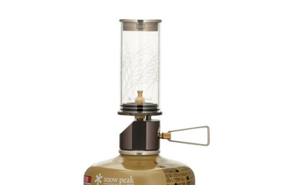

- Size: 42 x 40 x 105(h)mm
- Weight: 102g
- Packed Size: 51 x 47 x 112(h)mm
- Materials:
  - Aluminum Alloy
  - Brass
  - Rubber
  - Glass
  - Stainless Steel
- Dedicated Container: GPK-110GR / GPK-250GR / GPK-500GR / GPK-110SR / GPK-250SR / GPK-500SR
- Burn Time:
  - GPK-110GR / 15hrs
  - GPK-250GR / 35hrs
  - GPK-500GR / 71hrs
- Note: Gas consumption and output measured in company lab. Use Snow Peak dedicated containers only.

### Mini Hozuki Black (FES-441-BK)

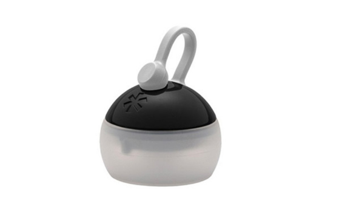

- Size: Φ62 x 75mm
- Weight: 57g (excl. battery)
- Materials:
  - Polycarbonate Resin
  - Elastomer Resin
  - ABS Resin
  - Silicone Rubber
  - PMMA Resin
- Operating Temp: 0–35°C
- Power Source: AAA Alkaline Battery (LR03) x3
- Continuous Use Time: Hi approx. 60hrs / Low approx. 100hrs
- Brightness: 60lm
- Waterproof Rating: IPX4
- Light Color: Warm White
- Lighting Mode: 3 modes (Hi/Low/Strobe/Flickering) + Stepless Dimming

### Mini Hozuki Khaki (FES-441-KH)

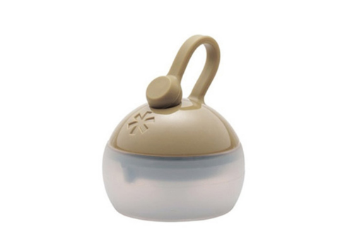

- Size: Φ62 x 75mm
- Weight: 57g (excl. battery)
- Materials:
  - Polycarbonate Resin
  - Elastomer Resin
  - ABS Resin
  - Silicone Rubber
  - PMMA Resin
- Operating Temp: 0–35°C
- Power Source: AAA Alkaline Battery (LR03) x3
- Continuous Use Time: Hi approx. 60hrs / Low approx. 100hrs
- Brightness: 60lm
- Waterproof Rating: IPX4
- Light Color: Warm White
- Lighting Mode: 3 modes (Hi/Low/Strobe/Flickering) + Stepless Dimming

### Mini Backpacker's Cup 2021 AUTUMN EDITION (FES-169)

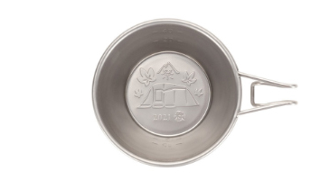

- Size: 70 x 70 x 30mm
- Weight: 30g
- Capacity: 60ml
- Materials: Stainless Steel

## 2021 Spring

### IGT Three-Unit Low Style Set Black (FES-136)

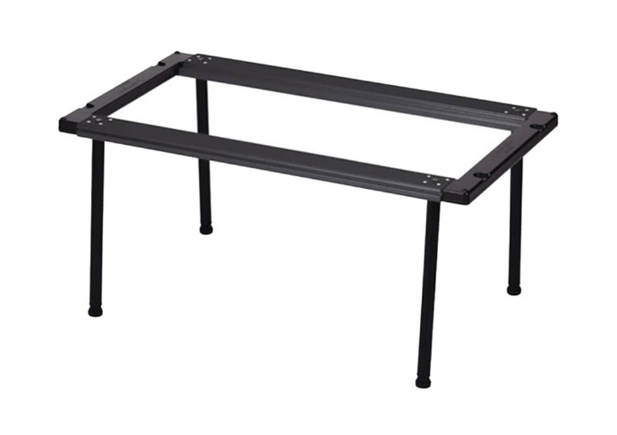

- Contents:
  - IGT Frame Body
  - IGT400 Leg x4
- Materials:
  - Frame: Aluminum Alloy, Stainless Steel
  - Leg: Stainless Steel, Resin
- Size:
- Frame: 846 x 496 x 30(h)mm
- Leg: Φ25 x 410mm

### IGT Four-Unit Low Style Set Black (FES-129)

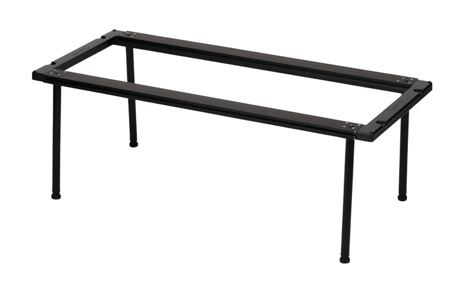

- Contents:
  - IGT Frame Body
  - IGT400 Leg x4
- Materials:
  - Frame: Aluminum Alloy, Stainless Steel
  - Leg: Stainless Steel, Plastic
- Size:
- Frame: 1,096 x 496 x 30(h)mm
- Leg: Φ25 x 410mm

### IGT 400 Leg Set Black (FES-137)

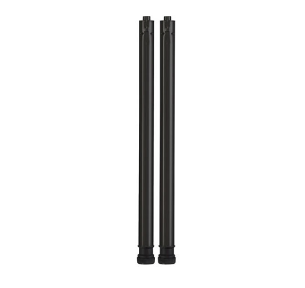

- Materials:
  - Stainless Steel
  - Resin
- Size: Φ25 x 410mm

### Take Long Chair Long Black (FES-055)

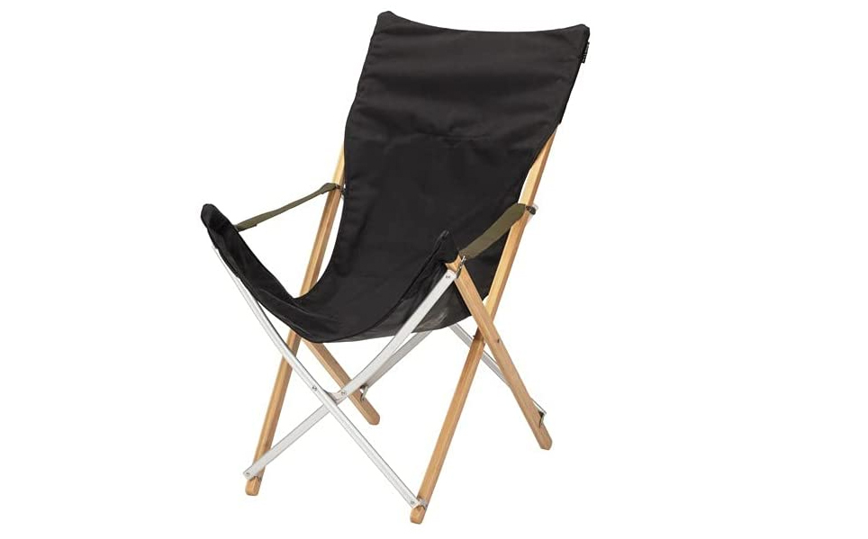

- Weight: 3.5kg
- Packed Size: 100 x 150 x 1,280(h)mm
- Size: 595 x 800 x 950(h)mm (seat height 360mm)
- Contents:
  - Body
  - Strap Belt
- Materials:
  - Body Frame: Laminated Bamboo, Metal (Aluminum Alloy, Stainless Steel)
  - Fabric: 1680D Nylon
  - Strap Belt: Cotton, Polyester

### Multi Container L Black (FES-135)

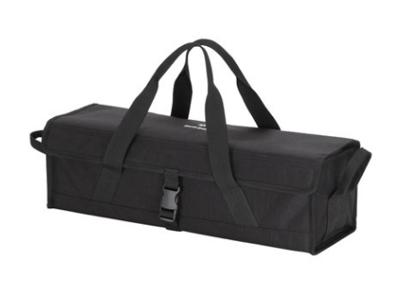

- Materials:
  - 1000D Nylon
  - PP Tape
  - Resin Board
- Size: 540 x 180 x 160(h)mm
- Weight: 1,500g

### Multi Container M Black (FES-134)

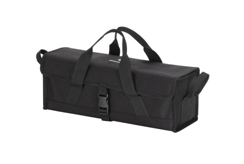

- Materials:
  - 1000D Nylon
  - PP Tape
  - Resin Board
- Size: 440 x 160 x 150(h)mm
- Weight: 1,200g

### Multi Container S Black (FES-133)

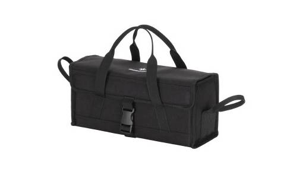

- Materials:
  - 1000D Nylon
  - PP Tape
  - Resin Board
- Size: 340 x 140 x 150(h)mm
- Weight: 900g

### Metal Logo Sticker Set MOUNTAIN (FES-138)

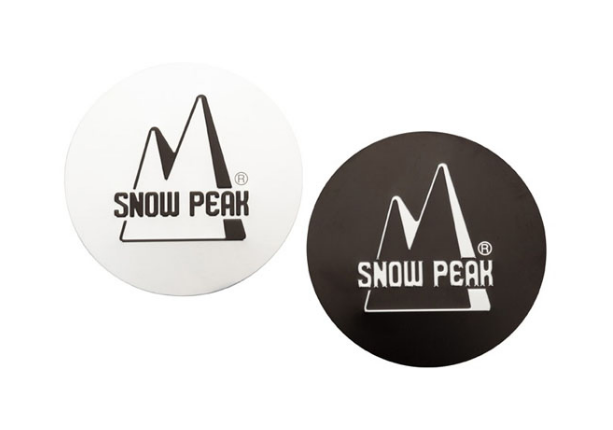

- Contents:
  - Sticker Body (Black) x1
  - Sticker Body (Silver) x1
- Materials: Aluminum
- Size: Φ60mm

### Single Action Low Table Bamboo Black (FES-131)

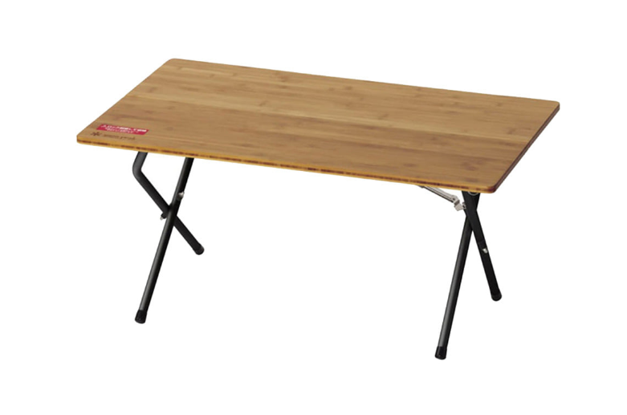

- Contents:
  - Body
  - Carrying Case
- Materials:
  - Tabletop: Laminated Bamboo
  - Stand: Aluminum (Anodized)
  - Case: Polyester
- Size: 846 x 496 x 400(h)mm
- Packed Size: 846 x 248 x 50(h)mm

### My Table Bamboo Black (FES-132)

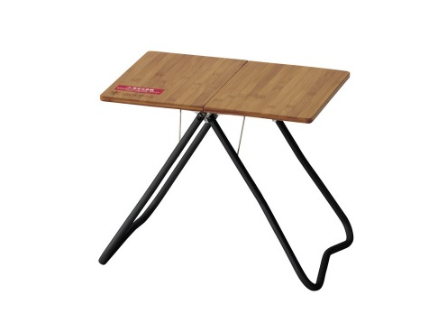

- Contents:
  - Body
  - Carrying Case
- Materials:
  - Tabletop: Laminated Bamboo
  - Stand: Aluminum (Anodized)
  - Case: Polyester
- Usage Size: 450 x 335 x 385(h)mm
- Tabletop Size: 450 x 330 x 12(h)mm

### Land Station Inner Room (FES-127)

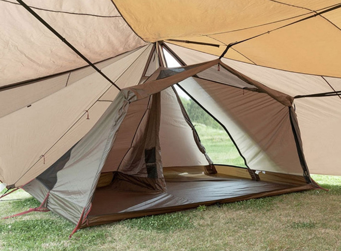

- Contents:
  - Inner Room Body
  - Ground Sheet
  - Duralumin Stake
  - Stake Case
  - Carrying Case
- Materials:
  - [Body] Panel: 68D Polyester Taffeta, PU Coating, Hydrostatic Head 1,800mm min., UV Protection
  - [Body] Mesh: 68D Polyester Mesh
  - [Body] Floor: 210D Polyester Oxford, PU Coating, Hydrostatic Head 1,800mm min.
  - [Ground Sheet]: 210D Polyester Oxford, PU Coating, Hydrostatic Head 1,800mm min.
- Packed Size: 20 x 20 x 61(h)cm
- Capacity: 4 persons

### Land Station Inner Room S (FES-128)

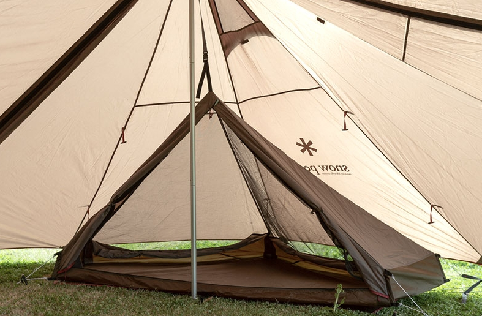

- Contents:
  - Inner Room Body
  - Ground Sheet
  - Duralumin Stake
  - Stake Case
  - Carrying Case
- Materials:
  - [Body] Panel: 68D Polyester Taffeta, PU Coating, Hydrostatic Head 1,800mm min., UV Protection
  - [Body] Mesh: 68D Polyester Mesh
  - [Body] Floor: 210D Polyester Oxford, PU Coating, Hydrostatic Head 1,800mm min.
  - [Ground Sheet]: 210D Polyester Oxford, PU Coating, Hydrostatic Head 1,800mm min.
- Packed Size: 18 x 13 x 46(h)cm
- Capacity: 1 person

### Mini Backpacker's Cup 2021 SPRING EDITION (FES-168)

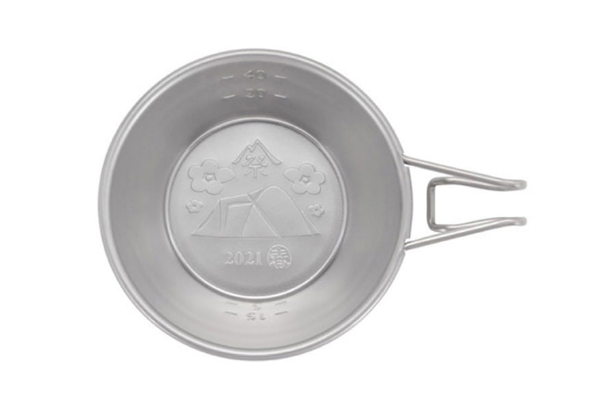

- Size: 70 x 70 x 30mm
- Weight: 30g
- Capacity: 60ml
- Materials: Stainless Steel

## 2020 Fall

### Land Lock Pro. Ivory Black Frame Edition (FES-090)

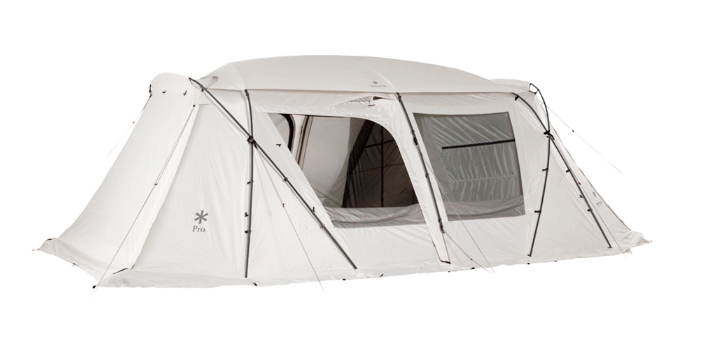

- Weight: 25.5kg / Packed Size: 75 x 33 x 36(h)cm
- Contents:
  - Body
  - Inner Room
  - Shield Roof
  - A-Frame (x2)
  - C-Frame (x2)
  - Center Frame
  - Ridge Pole
  - Duralumin Stake (21cm x27)
  - Stopper Rope (1.5m x2, 2.5m x4, 3.5m x6)
  - Seam Grip
  - Stake Case
  - Frame Case
  - Carrying Case
  - Compression Belt (x2)
- Capacity: 6 persons
- Materials:
  - Body (roof): 150D Polyester Ripstop, PU Coating, Hydrostatic Head 1,800mm min., UV Protection, Teflon Water-Repellent
  - Body (wall): 150D Polyester Ripstop, PU Coating, Hydrostatic Head 1,800mm min., UV Protection
  - Frame: A6061 (ø19mm), A6061 (ø22mm)
  - Inner Room: 68D Polyester Taffeta (wall), 210D Polyester Oxford, PU Coating, Hydrostatic Head 1,800mm min. (floor)
  - Roof Sheet: 75D Polyester Ripstop, PU Coating, Hydrostatic Head 1,800mm min., UV Protection, Teflon Water-Repellent

### Land Station M PC (FES-805)

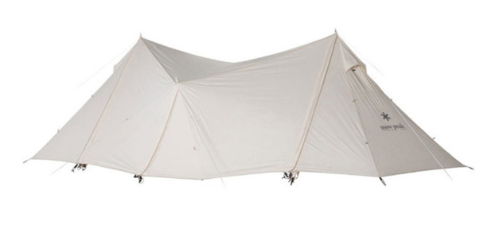

- Weight: 13.2kg
- Size: 76 x 28 x 33 (h)mm
- Contents:
  - Tarp Body
  - Roof Tape
  - Stopper Rope Y-type 9.0m (x2)
  - Stopper Rope 7.0m (x2)
  - Pole Case
  - Stake Case
  - Carrying Case
  - User Guide
- Materials:
  - Body: Cotton Blended Fabric (Polyester 65%, Cotton 35%), Water-Repellent
  - Carrying Case: Polyester

### Take Chair Black (FES-185)

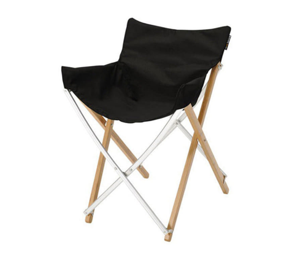

- Weight: 3kg
- Packed Size: 100 x 150 x 980(h)
- Contents:
  - Body
  - Strap
- Materials:
  - Body Frame: Laminated Bamboo, Metal (Aluminum Alloy, Stainless Steel)
  - Seat Cloth: 1680D Nylon
  - Strap: Cotton, Polyester

### Garden Low Chair 30 Black (FES-089)

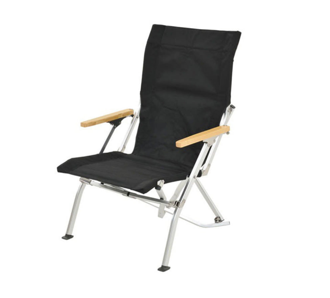

- Size: 580 x 650 x 860(h)mm (seat height 300mm)
- Weight: 3.6kg
- Packed Size: 160 x 180 x 1010(h)
- Contents:
  - Body
  - Carrying Case

### Garden FD Chair Black (FES-088)

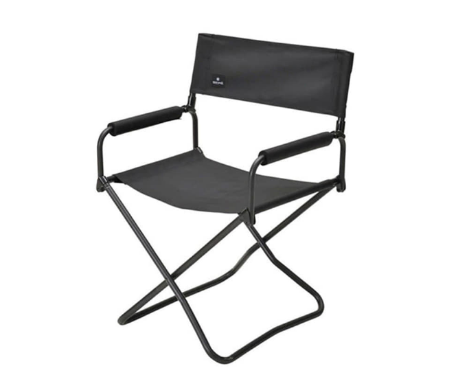

- Size: 595 x 580 x 840(h)mm (seat height 460mm)
- Weight: 3.6kg
- Packed Size: 580 x 110 x 690(h)
- Materials:
  - Frame: Metal (Aluminum Alloy)
  - Seat: 1680D Nylon
  - Armrest: 1680D, Urethane Foam

### Vacuum-Insulated Festival Mug 300 Matte (FES-123)

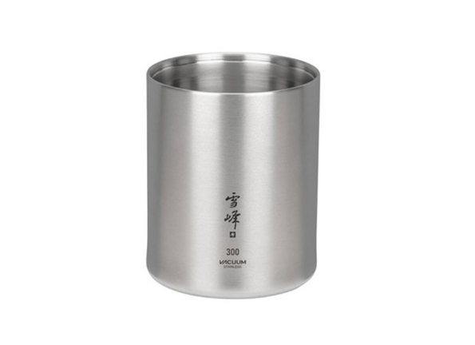

- Size: φ73.4 x 90.3(h)mm
- Materials: Stainless Steel
- Weight: 90g

### System Bottle Titanium 350 (FES-181)

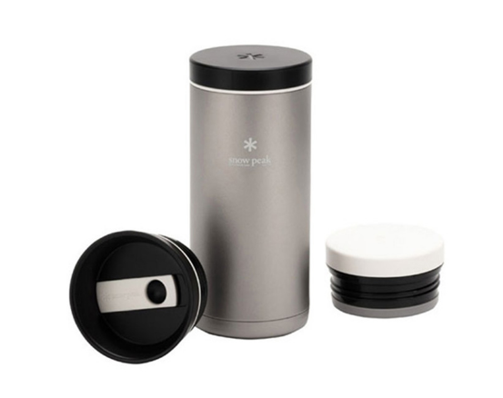

- Size:
  - Cooler Lid
  - Insulated Lid attached: φ77 x 174(h)mm
  - Tumbler Lid attached: φ81 x 177(h)mm
- Weight:
  - Bottle Body: 165g
  - Cooler Lid: 90g
  - Insulated Lid: 41g
  - Tumbler Lid: 38g
- Contents:
  - Bottle Body x1
  - Cooler Lid x1
  - Insulated Lid x1
  - Tumbler Lid x1
- Specifications:
- Materials:
  - Bottle Body: Titanium
  - Cap Lid: Polypropylene
  - Packing: Silicone Rubber
  - Insulation: Expanded Styrofoam
  - Cooling Agent: Water-Absorbing Polymer, Stabilizer, Preservative, PE Film

### Hozuki Shade 2020 Edition (FES-079)

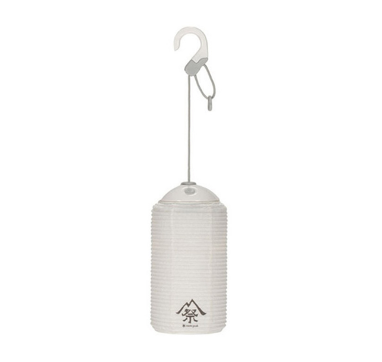

- Size: φ110mm x 170mm (main unit only)
- Weight: 50g
- Packed Size: φ110mm x 40mm (main unit only)
- Materials: Mulberry Paper

### Mini Backpacker's Cup 2020 AUTUMN EDITION (FES-167)

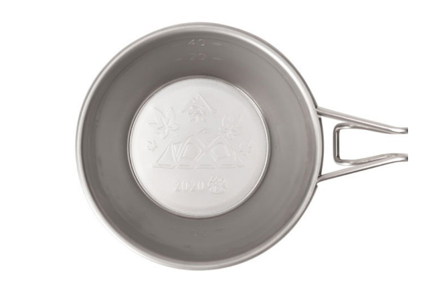

- Size: 70 x 70 x 30mm
- Weight: 30g
- Capacity: 60ml
- Materials: Stainless Steel

## 2020 Spring

### IGT Single Table Bamboo (FES-216)

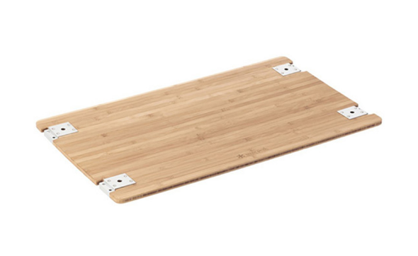

- Size: 846 x 496 x 25mm
- Weight: 5.0kg
- Materials:
  - Laminated Bamboo
  - Metal (Aluminum Alloy)

### IGT Cutting Board W (FES-215)

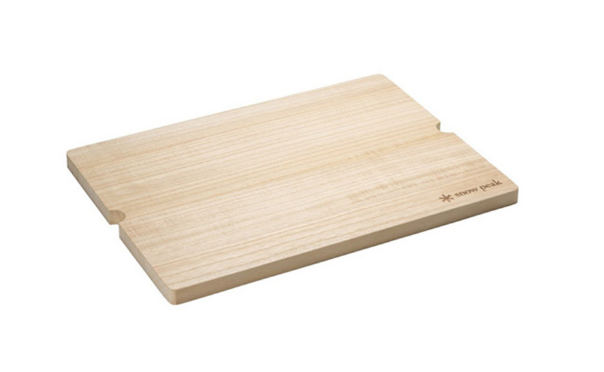

- Size: 500 x 360 x 20(h)mm
- Weight: 1kg
- Materials: Paulownia

### Firepit L Complete Case (FES-032BK)

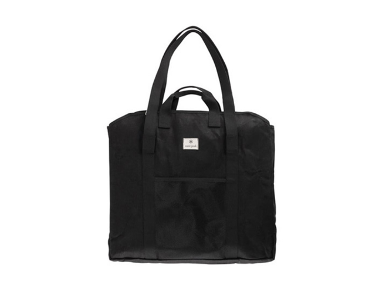

- Materials:
  - Cotton Canvas (No. 6 Paraffin, PU Processing)
  - Acrylic Tape (core: PP)
  - Nylon Mesh
- Size: 550 x 85 x 520 (h)mm
- Weight: 860g

### Titanium Single Mug (FES-115)

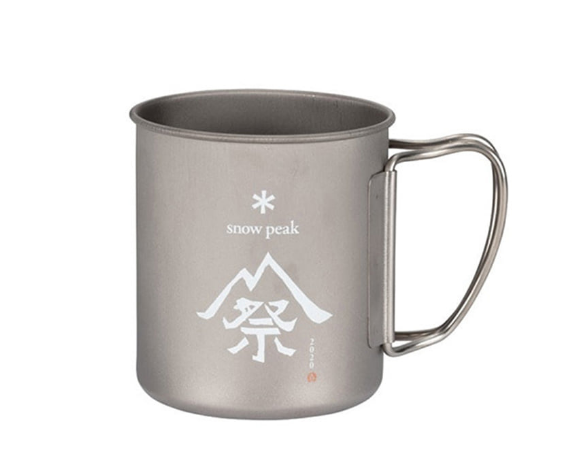

- Materials: Titanium
- Body Size: ø76.2 x H82mm
- Weight: 50g
- Full Capacity 300ml

### Book Cover Black (FES-068)

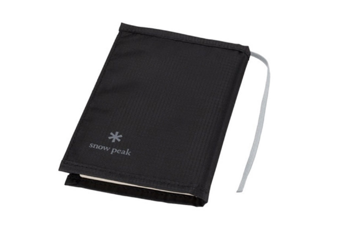

- Materials: 420D Polyester Oxford Ripstop, PU Coating
- Size: For applicable books: paperback size (150 x 152(h) x thickness up to 25mm)
- Weight: 30g

### Metal Logo Sticker Classic (FES-069)

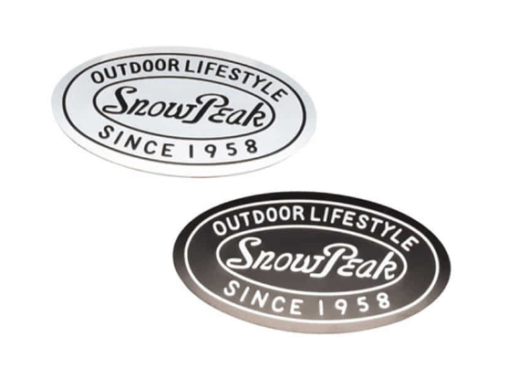

- Contents:
  - Sticker Body (Black) x 1
  - Sticker Body (Silver) x 1
- Materials: Aluminum
- Size: 70 x 32 x 28(h)mm

### Mini Backpacker's Cup 2020 SPRING EDITION (FES-166)

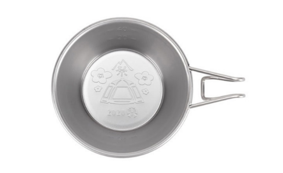

- Size: 70 x 70 x 30mm
- Weight: 30g
- Capacity: 60ml
- Materials: Stainless Steel

### Gear Tenugui (AC-20SU901BK, AC-20SU901RD)

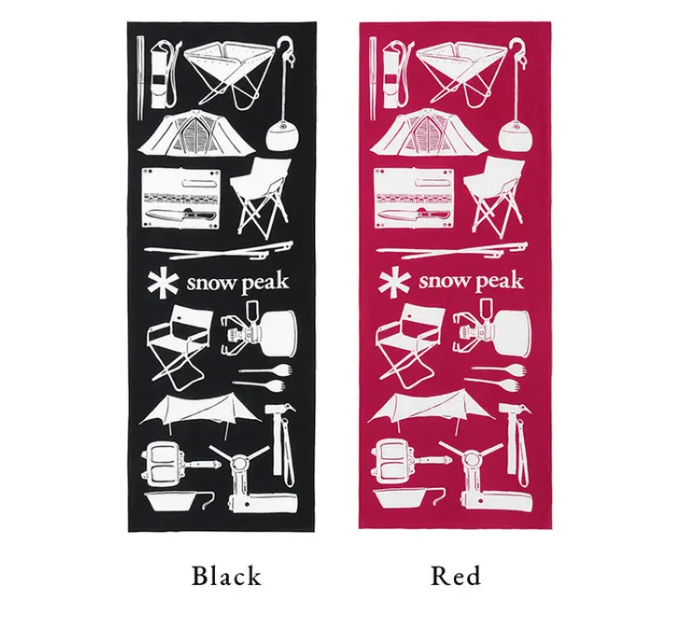

* Materials: 100% Cotton

### Mug Cover Beige L (FES-106)

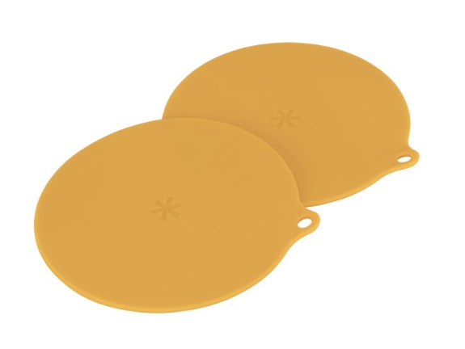

- Size: Φ130 x 3mm
- Weight: 50g (per piece)
- Quantity: 2 pieces
- Materials: Silicone Rubber

## 2019 Fall

### TAKIBI Tarp Shield Octa (FES-430)

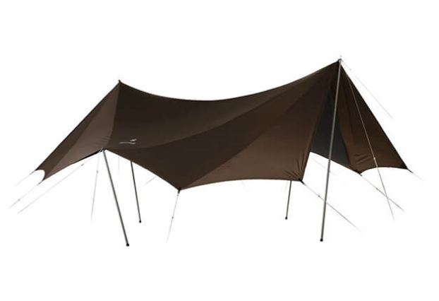

- Materials:
  - Tarp Body: 210D Polyester Oxford, PU Coating, Hydrostatic Head 1,800mm min., Teflon Water-Repellent, UV Protection
  - Inner Roof: Poly-Cotton Blend

### Mug Cover Brown (FES-054)

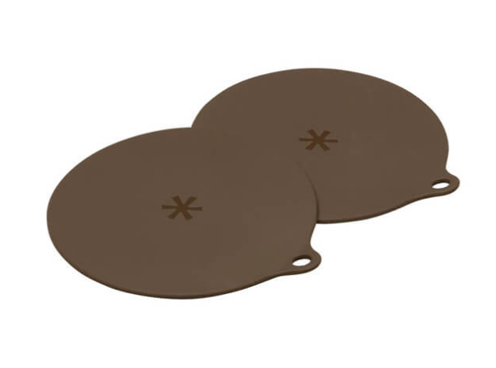

- Materials: Silicone Rubber

### Mini Backpacker's Cup 2019 AUTUMN EDITION (FES-165)

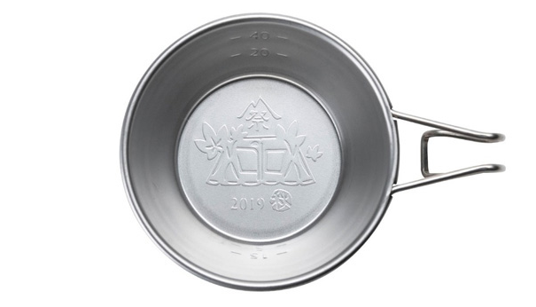

- Size: 70 x 70 x 30mm
- Weight: 30g
- Capacity: 60ml
- Materials: Stainless Steel

### Mini Flame 2019 Edition (GL-140CL)

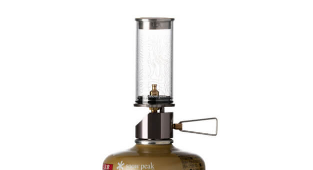

- Size: 42 x 40 x 105(h)mm
- Weight: 102g
- Materials:
  - Aluminum Alloy
  - Brass
  - Rubber
  - Glass
  - Stainless Steel

### Rainbow Stove Black Set (KH-003BK-SET)

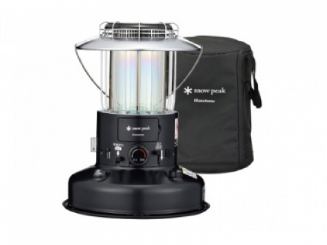

* Size: 388 x 388 x 485.7mm
* Weight: 6.2kg
* Heating Output: 1.25–2.50kW
* Coverage Area: 15.0㎡ (approx. 4.5 pyeong)
* Fuel Tank Capacity: 4.9L
* Continuous Use Time: 20.2–40.2h
* Fuel Consumption: 0.122–0.243L/h
* Battery sold separately
* Dedicated bag included

## 2019 Spring

### Land Lock Ivory Red Frame Edition (FES-671)

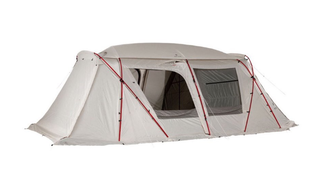

- Contents:
  - Body
  - Inner Room
  - Roof Sheet
  - A-Frame (x2)
  - C-Frame (x2)
  - Center Frame
  - Ridge Pole
  - Duralumin Stake (21cm x27)
  - Stopper Rope (1.5m x2, 2.5m x4, 3.5m x6)
  - Seam Grip
  - Stake Frame Bag
  - Carrying Bag
  - Compression Belt (x2)
- Specifications:
- Materials:
  - Body (roof): 150D Polyester Oxford, PU Coating, Hydrostatic Head 1,800mm min., UV Protection, Teflon Water-Repellent
  - Body (wall): 150D Polyester Oxford, PU Coating, Hydrostatic Head 1,800mm min., UV Protection, Teflon Water-Repellent
  - Frame: A6061 (ø19mm)
  - Inner Room (wall): 68D Polyester Taffeta
  - Inner Room (floor): 210D Polyester Oxford, PU Coating, Hydrostatic Head 1,800mm min.
  - Roof Sheet: 75D Polyester Taffeta, PU Coating, Hydrostatic Head 1,800mm min., UV Protection, Teflon Water-Repellent
- Case Size:
  - Carrying Case: 75 x 33 x 36(h)cm
  - Frame Case: 72 x 17 x 22(h)cm
- Capacity: 6 persons

### IGT Side Tray (FES-245)

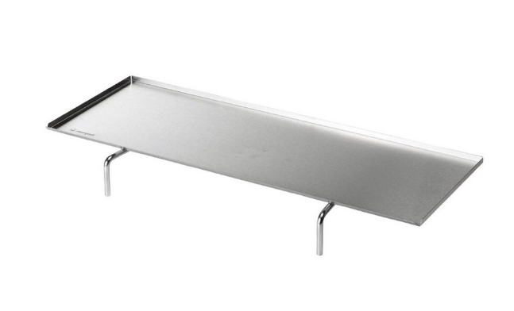

- Weight: 950g
- Set Contents: Body
- Specifications:
- Materials: Stainless Steel

### Mini Backpacker's Cup 2019 SPRING EDITION (FES-164)

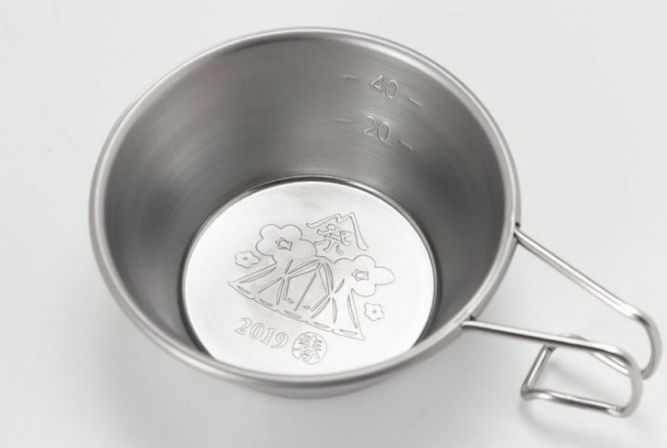

- Size: 70 x 70 x 30mm
- Weight: 30g
- Capacity: 60ml
- Materials: Stainless Steel

### IGT Kitchen Paper Holder (FES-067)

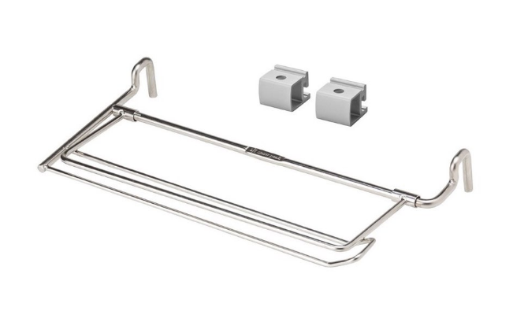

- Contents:
  - Body
  - Rail Joint x2
- Specifications:
- Materials: Stainless Steel

### Metal Logo Sticker Set (FES-036)

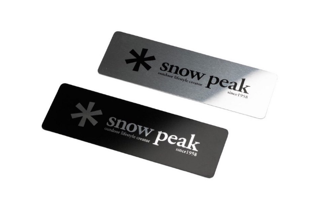

- Size:
- Body Size: 100 x 33mm
- Specifications:
- Materials: Aluminum
- Contents:
  - Silver x 1
  - Black x 1

## 2018 Fall

### Living Shell S Pro. (FES-240)

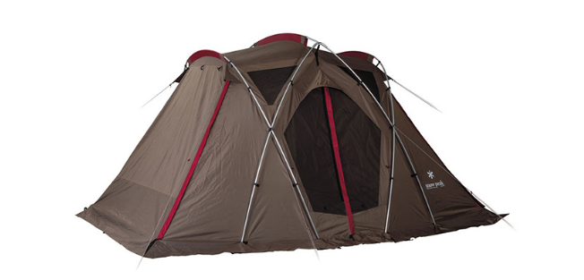

- Contents:
  - Body
  - A-Frame (x2)
  - Ridge Pole (x1)
  - C-Frame (x2)
  - Upright Pole (x2)
  - Duralumin Stake (21cm x22)
  - Triangle Pocket (x2)
  - Compression Belt (x2)
  - Stopper Rope (3.5m x4, 7m x2, 2m x4)
  - Seam Sealant
  - Carrying Case
  - Frame Case
  - Stake Case
- Specifications:
- Materials:
  - Roof: 210D Polyester Ripstop, Light-Blocking Pigment, PU Coating, Hydrostatic Head 3,000mm min., UV Protection, Teflon Water-Repellent
  - Side: 150D Polyester Ripstop, PU Coating, Hydrostatic Head 1,800mm min., UV Protection, Teflon Water-Repellent
  - Mud Skirt: 150D Polyester Ripstop, PU Coating
  - Frame: A6061 (ø16mm+ø19mm)

### Land Lock Side Tarp (FES-270)

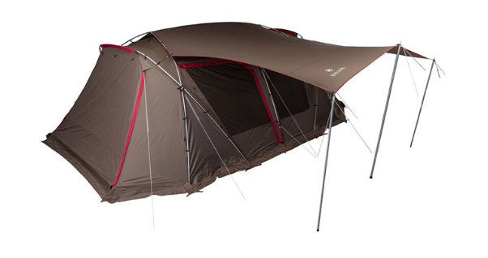

- Contents:
  - Tarp Body
  - Inner Roof
  - Stopper Rope (Y-type 10m x2, 3.5m x5)
  - Carrying Case
  - Inner Roof Case
  - Pole Case
  - Stake Case
- Materials:
  - Body: 210D Polyester Oxford, PU Coating, Hydrostatic Head 3,000mm, UV Protection, Teflon Water-Repellent
  - Inner Roof: 68D Polyester Taffeta
- Packed Size: 80 x 18 x 26(h)cm
- Weight: 3.9kg

### Hozuki Shade 2018 Edition (FES-056)

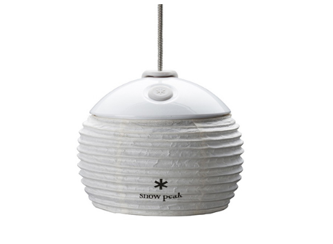

- Size: approx. ø110 x 62mm
- Materials: Mulberry Paper (water-repellent)

### Rainbow Stove 2018 Edition (KH-001LB)

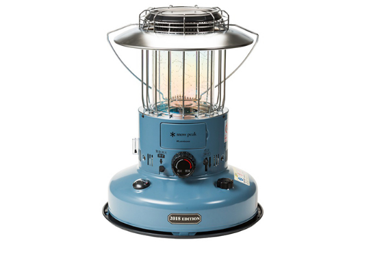

- Size: 388 x 388 x 485.7mm
- Weight: approx. 6.2kg
- Heating Output: 2.5kW
- Fuel Consumption: 0.243L/h
- Fuel Tank Capacity: 4.9L
- Continuous Use Time: approx. 20 hours
- Natural Ventilation Open Kerosene Stove (Convection)
- Battery Ignition (sold separately)
- Uses Kerosene
- Anti-Tipping Auto-Shutoff

### Mini Flame 2018 EDITION (GL-140LB)

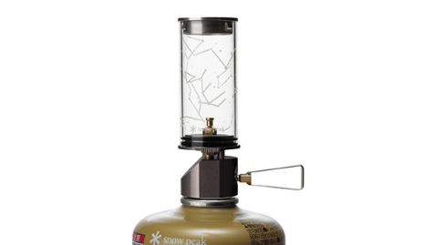

* Contents: Body, User Guide
* Features: 2018 limited production. The black globe features an engraved "constellation" pattern.
* Materials: Aluminum Alloy, Brass, Rubber, Glass, Stainless Steel
* Size: 42 x 40 x 105(h)mm
* Weight: 102g
* Packed Size: 51 x 47 x 112(h)mm

## 2018 Spring

### Gear Container 2018 FES Edition (FES-066)

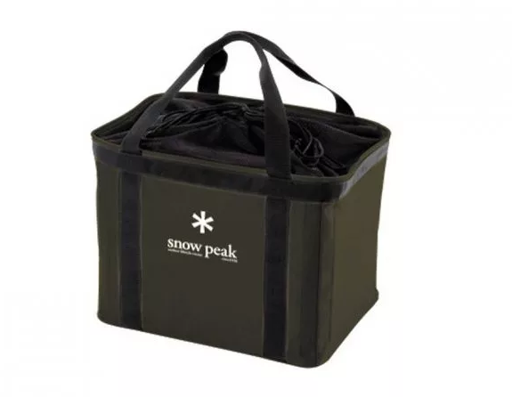

- Size: 380 x 280 x 310mm
- Weight: 880g
- Materials:
  - Fabric: 100% Polyester (PVC Processing)
  - Backing Fabric: Nylon
  - Mesh: Polyester
  - Handle: Polypropylene
  - Bottom Board: Bellporen

### IGT Cutting Board W (FES-215)

- Size: 500 x 360 x 20(h)mm
- Weight: 1kg
- Materials: Paulownia

### Logo Tape 2018 FES Edition (FES-108)

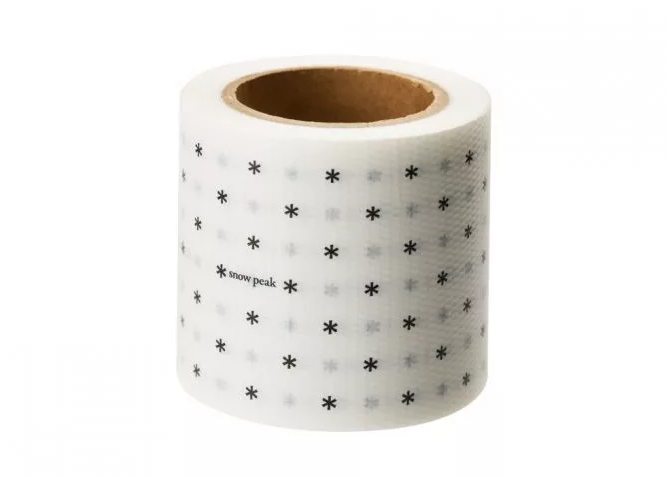

- Size: ø47 x 45mm
- Weight: 40g
- Materials: Polyethylene

### Land Lock Gold Brown Frame Set (FES-180)

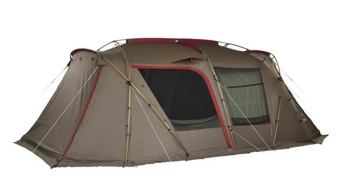

- Weight: 8.8kg
- Materials: Frame: A6061 (ø16mm+ø19mm)
- Contents:
  - Tent Frame (A-Frame x2, C-Frame x2, Center Frame, Ridge Pole)
  - Carrying Case

## 2017 Fall

### Connect Tarp Hexa Gray (FES-265)

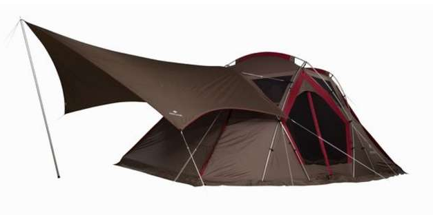

- Materials: Body: 210D Polyester Oxford, Light-Blocking Pigment PU Coating, Hydrostatic Head 3,000mm min., Teflon Water-Repellent, UV Protection
- Carry Bag Size: W800 x D200 x H200mm
- Weight: 2.8kg
- Color: Gray

### Low Chair Blanket Khaki (FES-126KH)

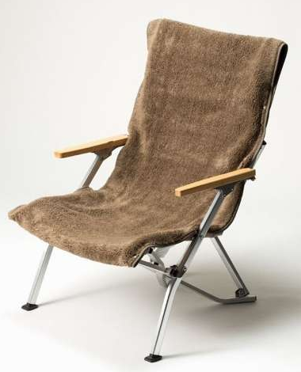

- Materials:
  - Outer: Polyester Fleece
  - Lining: Sweatshirt Fabric
- Size:
  - W570 x D1400 x H5mm
  - Packed Size: W250 x D240 x H130mm
- Weight: 342g
- Color: Khaki

### Rainbow Stove 2017 Edition (KH-001NK)

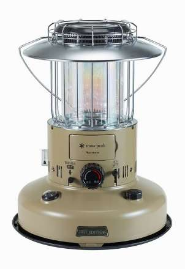

- Type: Natural Ventilation Open Kerosene Stove / Natural Convection
- Ignition Method: Battery Ignition (C-Type Battery x2, sold separately)
- Fuel Type: Kerosene
- Max Fuel Consumption: 2.5kW (0.243L/h)
- Heating Output: 2.5kW
- Fuel Tank Capacity: 4.9L Continuous Burning Time: approx. 20 hours
- Outer Dimensions (incl. base): W388 x D388 x H485.7mm
- Weight: approx. 6.2kg
- Wick (type): Heat-resistant standard wick
- Wick (size): Inner diameter 65mm, thickness 2.5mm, absorption rate 200%
- Safety Device: Anti-Tipping Auto-Shutoff (Wick Lowering Method) ※ Snow Peak Rainbow Stove case is sold separately.

### Mini Flame 2017 Edition (GL-140NK)

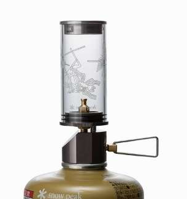

- Contents:
  - Body
  - User Guide
- Materials:
  - Aluminum Alloy
  - Brass
  - Rubber
  - Glass
  - Stainless Steel
- Size: 42 x 40 x 105(h)mm
- Weight: 102g
- Packed Size: 51 x 47 x 112(h)mm

### Triangle Sticker (FES-027)

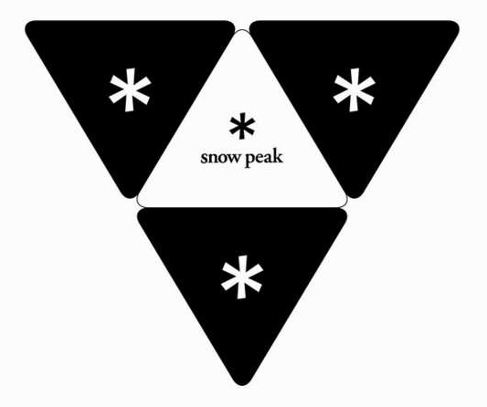

- Size: 100 x 82mm

## 2017 Spring

### Tarp Extension Recta L Gray (FES-200)

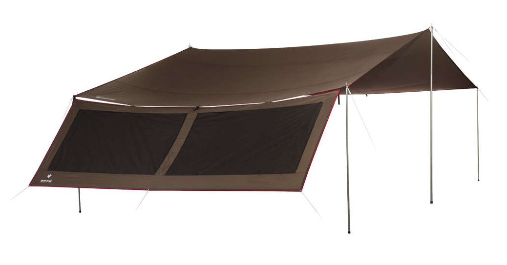

- Materials: Body: 210D Polyester Oxford, Light-Blocking Pigment PU Coating, Hydrostatic Head 3,000mm min., Teflon Water-Repellent, UV Protection
- Contents:
  - Sheet Body
  - Stopper Rope (150cm x3)
  - Rope (50cm x3)
  - Duralumin Stake (17cm x3)
  - Body Carrying Case
  - Stake Case
- Size: 420 x 148cm
- Weight: 1.6kg

### Titanium Single Mug 450 Domi Edition (FES-250)

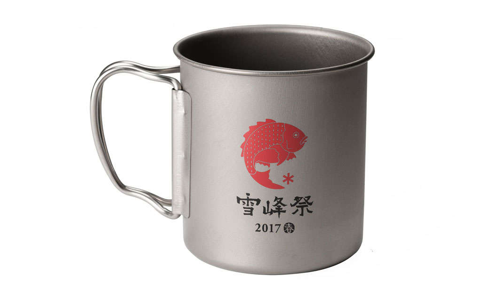

- Materials: Titanium
- Size: ø85 x 92mm
- Capacity: 450ml
- Weight: 70g

### Flag Garland Khaki & Ivory (UG-441)

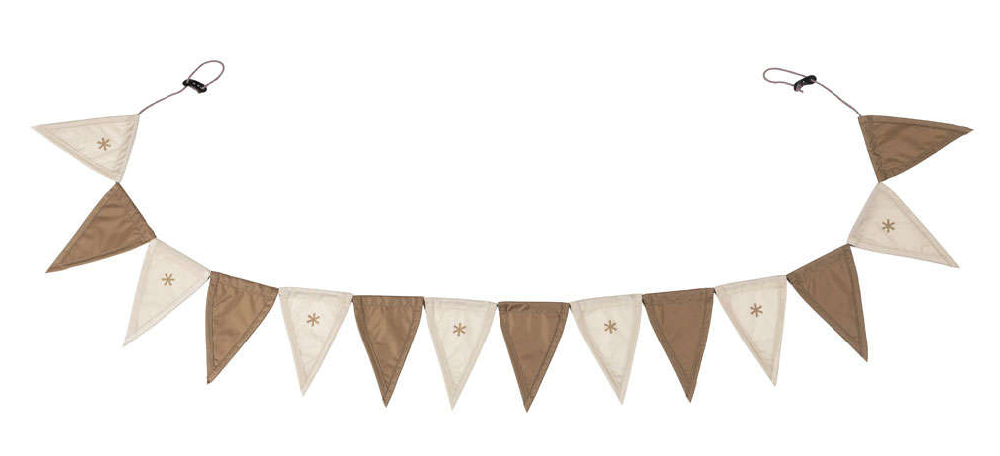

- Materials:
  - 75D Silicone Polyester Ripstop (Khaki)
  - 75D Polyester Taffeta (Ivory)
  - Polypropylene (Rope)
  - Aluminum Alloy (Hardware)
- Size:
  - Flag Size: 100 x 150 (h) mm
  - (Rope Length) 2m
- Origin: China

### Mosquito Coil Pig Black Edition (FES-087BK)

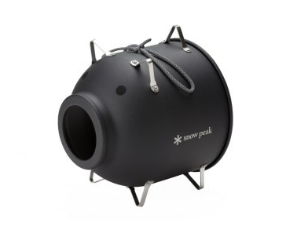

- Materials:
  - Body: Aluminum
  - Legs, Ears & Tail Parts: Stainless Steel
  - Hanging Hook: Stainless Steel
  - Sheath Cord: Polyester
- Body Size: 137 x 148 x 165(h)mm
- Weight: 150g

### Limited Tarp Flag Khaki (UG-445KH)

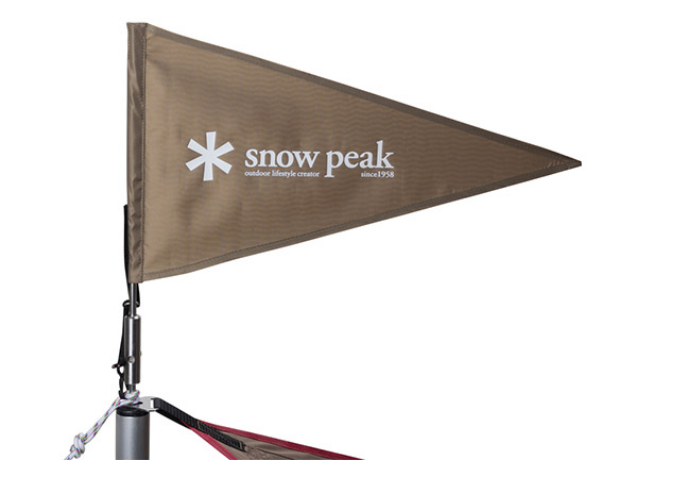

* Materials:
  - Flag: Nylon
  - Pole: Stainless Steel
* Size: 395 x 14 x 310(h)mm
* Packed Size: ø22 x 310(h)mm
* Weight: 130g

## 2016 Fall

### Triangle Sticker (FES-027)

- Size: 100 x 82mm

### Low Chair Blanket (FES-126)

- Contents:
  - Body
  - User Guide
- Materials:
  - Cover Fabric: Polyester High-Loft Fleece
  - Lining: Sweatshirt Fabric
  - Piping Pocket: Jersey
- Size: 570 x 1400 x 5mm
- Storage Size: 250 x 240 x 130mm
- Weight: 342g

### Rainbow Stove 2016 Edition (KH-001BK)

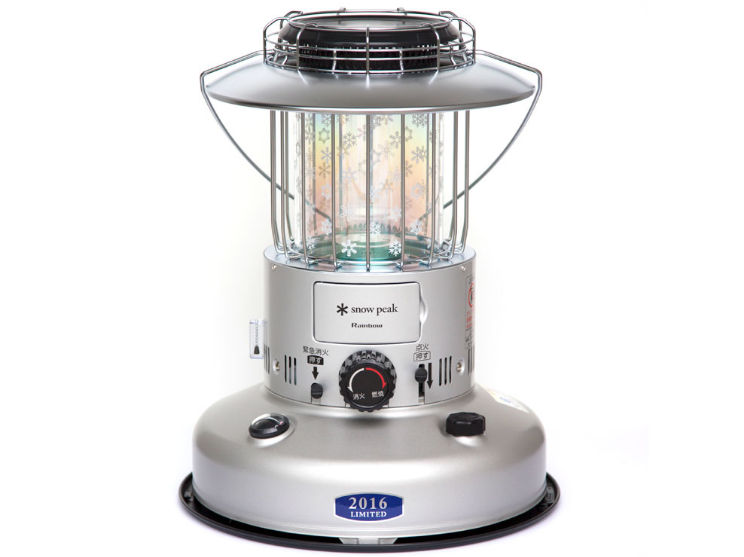

### IGT Wind Screen Regular (FES-161)

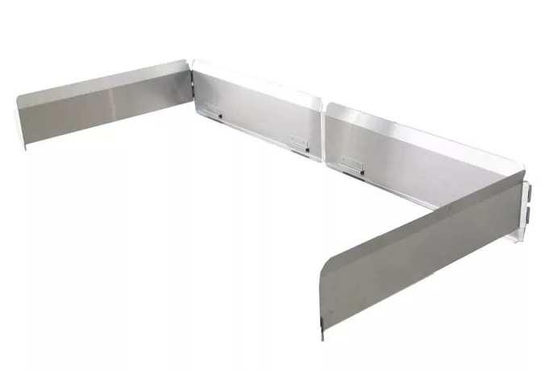

- Materials: Stainless Steel
- Body Size: 502 x 412 x 150mm
- Storage Size: 502 x 412 x 20mm
- Weight: 0.8kg (x2) *for 3 units

### IGT Wind Screen Long (FES-162)

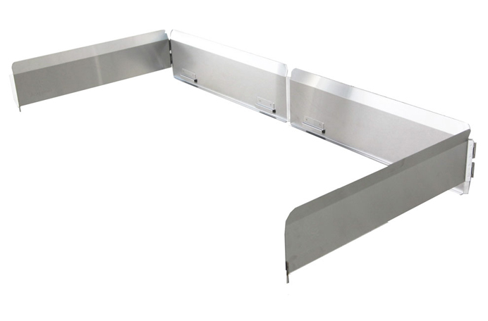

- Materials: Stainless Steel
- Body Size: 502 x 542 x 150mm
- Packed Size: 542 x 150 x 20mm
- Weight: 0.92kg (x2)

## 2016 Spring

### Aluminum Calderon 24 (CS-240)

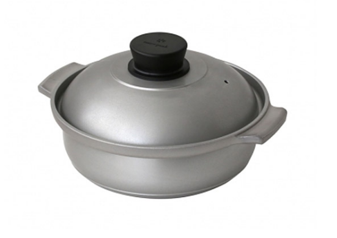

- Materials:
  - Body, Lid: Aluminum Alloy (Anodized)
  - Lid Handle: Phenol Resin
  - Carrying Case: Nylon
- Size: Max inner ø24cm, Inner ø22cm (bottom thickness 3.5mm)
- Packed Size: 294 x 250 x 89(h)mm
- Full Capacity: 3.1L
- Weight: Body/1.3kg

### Limited Tarp Flag (UG-445)

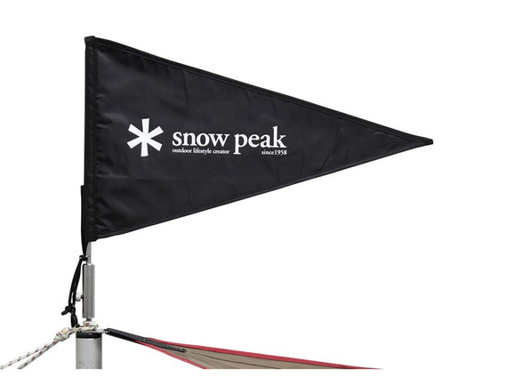

- Size: 392 x 14 x 308mm
- Packed Size: ø22 x 308mm
- Materials: Nylon, Stainless Steel
- Weight: 128g

### Mosquito Coil Pig (FES-087)

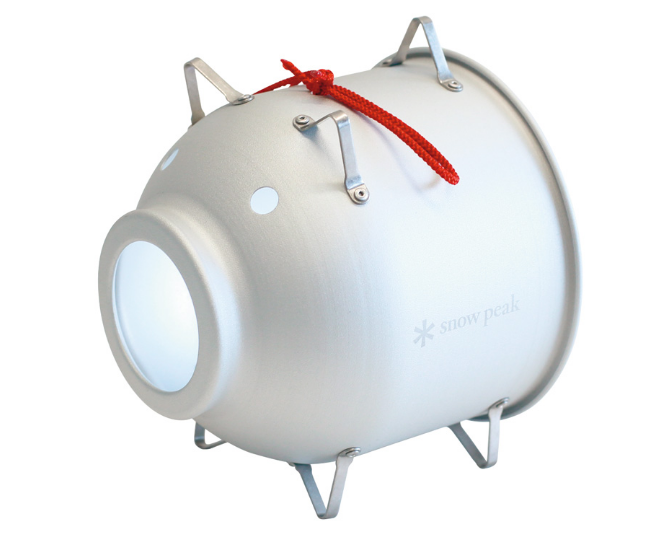

- Materials:
  - Body: Aluminum
  - Legs, Ears & Tail Parts: Stainless Steel
  - Mosquito Coil Holder: Stainless Steel
  - Cord: Rayon
- Size: 136 x 148 x 165(h)mm
- Weight: 150g

### Amenity Tarp Hexa L Set (TP-851S)

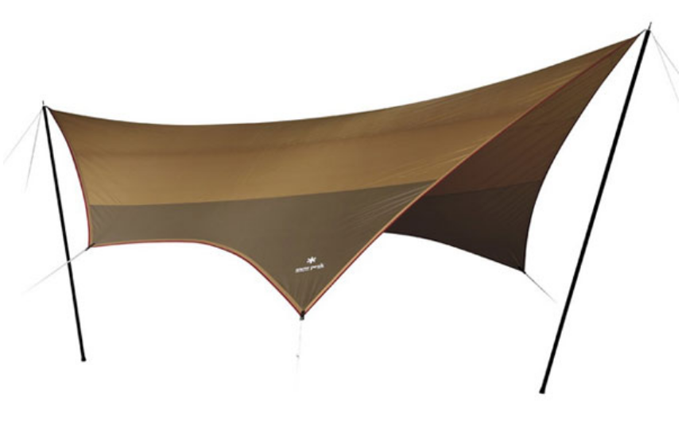

- Materials: 210D Polyester Oxford, PU Coating, Hydrostatic Head 1,800mm min., Teflon Water-Repellent, UV Protection
- Contents:
  - Tarp Body
  - Steel Pole (260cm, 240cm)
  - Steel Stake 30cm (x8)
  - Stopper Rope (Y-type 10m x2, 3m x2, 2m x2)
  - Pole Case
  - Stake Case
  - Carry Bag
  - User Guide
- Carry Bag Size: 80 x 17 x 22(h)cm
- Weight: 7kg

## 2015 Fall

### Classic Tarp Hexa L (FES-101)

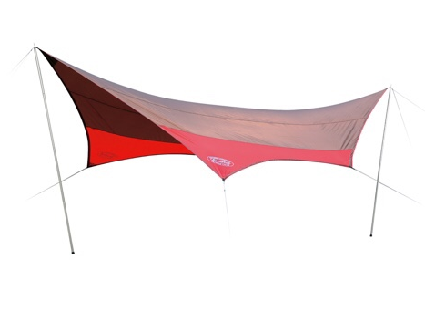

- Materials: Body: 210D Polyester Oxford, Light-Blocking Pigment PU Coating, Hydrostatic Head 3,000mm min., UV Protection, Teflon Water-Repellent (Initial Water Repellency 100, 90 after 5 washes)
- Contents:
  - Body
  - Stopper Rope (Y-type 10m x2, 3m x2, 2m x2)
  - Pole Case
  - Stake Case
  - Carry Bag
- Carry Bag Size: 80 x 17 x 22(h) cm
- Weight: 3.6kg (incl. body & rope)
- Color: Gray x Burgundy
- Notes: Poles, stakes, hammer, and stake & hammer case are not included.

### Classic Tarp Recta L (FES-102)

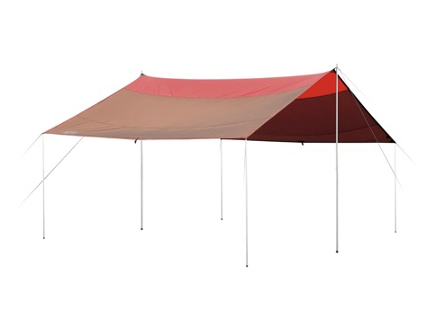

- Materials: Body: 210D Polyester Oxford, Light-Blocking Pigment PU Coating, Hydrostatic Head 3,000mm min., UV Protection, Teflon Water-Repellent (Initial Water Repellency 100, 90 after 5 washes)
- Contents:
  - Body
  - Stopper Rope (10m x2, 3m x8)
  - Pole Case
  - Stake Case
  - Carrying Bag
- Bag Size: 80 x 17 x 22 (h)mm
- Weight: 5.0kg (incl. body & rope)
- Color: Gray x Red
- Notes: ※ Poles, stakes, hammer, and stake & hammer case are not included.

### Hozuki Dress Sheet (FES-104)

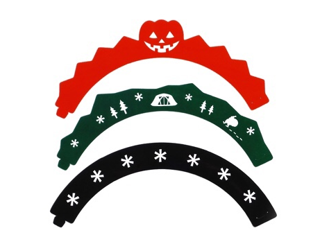

### My Table House (UG-034)

* Materials:
  - Fabric: Tarpaulin
  - Belt: PP
  - Core: PVC
  - Velcro: Polyester
- Size: 250 x 243 x 170 (h)mm
- Packed Size: 250 x 20 x 100 (h)mm
- Weight: 350g
- My Table not included.
- Not waterproof.
- Do not place items over 1kg on this product.

### Goro (CS-012)

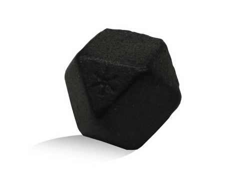

* Size: 30 x 30 x 30mm
* Weight: approx. 120g (per piece)
* Materials: Cast Iron
* Contents: Body x4, User Guide

## 2015 Spring

### Flag Garland (UG-440)

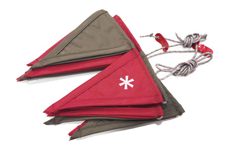

* Materials: 210D Polyester Oxford, Polypropylene (rope), Aluminum Alloy (hardware)
* Size: Flag 100 x 150(h)mm, Rope length 2m

### IGT Bamboo Tray W (CK-030)

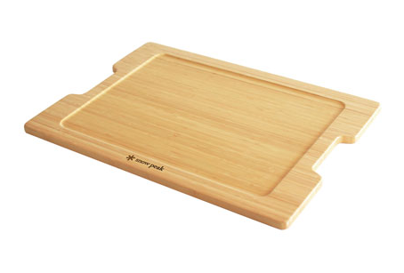

* Materials: Laminated Bamboo
* Size: 500 x 360 x 15(h)mm
* Weight: 1.7kg

### Low Chair 30 Classic Red (LV-091RD)

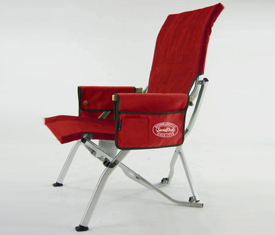

* Contents: Body x1, Carrying Case x1, Side Pocket x2
* Materials:
  - Frame: Aluminum Alloy
  - Armrest: Laminated Bamboo
  - Metal Parts: Stainless Steel
  - Seat: Polyester
* Size: 58 x 65 x 86(h)cm (seat height 30cm)
* Packed Size: 160 x 180 x 101(h)mm
* Weight: 3.6kg (excl. side pocket)

### Low Chair 30 Classic Gray (LV-091GY)

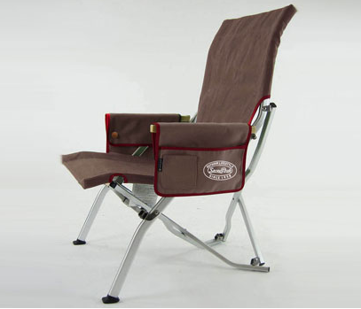

* Contents: Body x1, Carrying Case x1, Side Pocket x2
* Materials:
  - Frame: Aluminum Alloy
  - Armrest: Laminated Bamboo
  - Metal Parts: Stainless Steel
  - Seat: Polyester
* Size: 58 x 65 x 86(h)cm (seat height 30cm)
* Packed Size: 160 x 180 x 101(h)mm
* Weight: 3.6kg (excl. side pocket)

### Mini Hozuki Luminous Shade (UG-276)

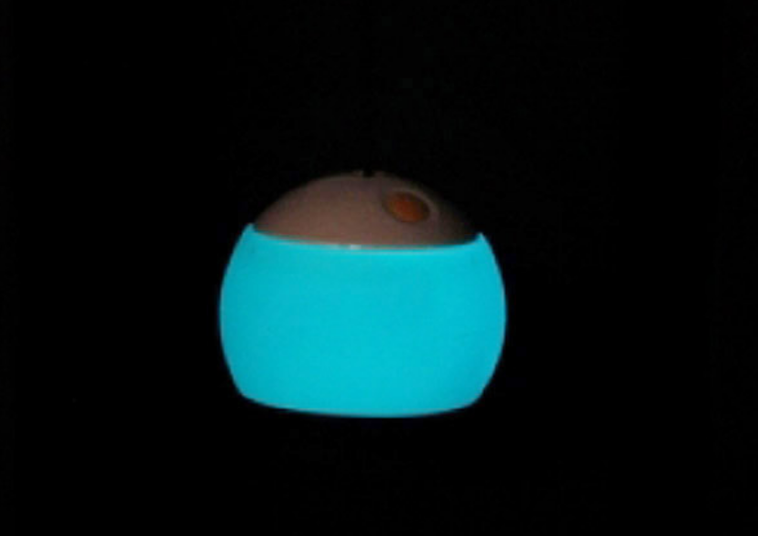

* Materials: Silicone
* Size: Φ62 x 30mm
* Weight: 12g

### Eco Cup Neoprene Case (E-075)

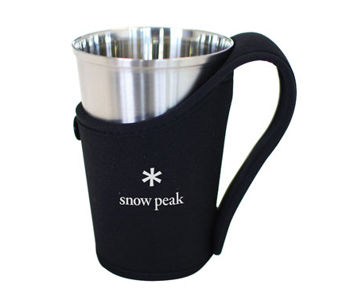

* Materials: Neoprene
* Size: Φ90 x 150(h)mm (when not attached)
* Weight: 30g

## 2014 Fall

### Shell Inner DUO (TP-530IR)

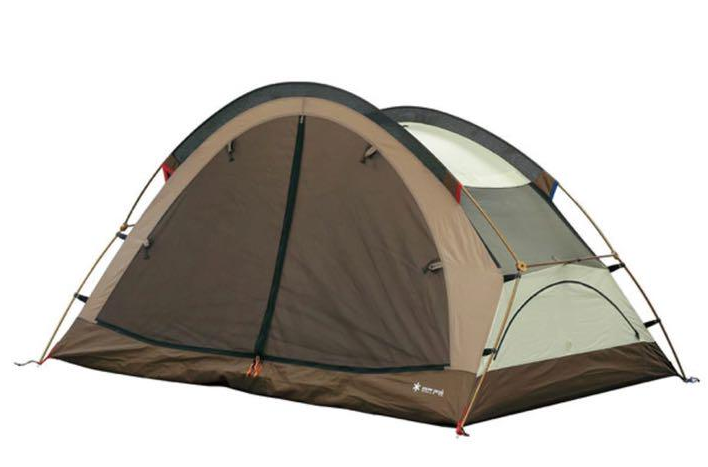

* Contents:
  - Inner Tent Body
  - Body Frame (x2)
  - Side Frame (x2)
  - Duralumin Stake (x4)
  - Ground Sheet
  - Body Case
  - Frame Case
  - Stake Case
  - Repair Pipe
  - User Guide
* Materials:
  - Inner Tent: 68D Polyester Taffeta
  - Floor: 210D Polyester Oxford, PU Coating, Hydrostatic Head 1,800mm min.
  - Ground Sheet: 210D Polyester Oxford, PU Coating, Hydrostatic Head 1,800mm min.
  - Frame: Duralumin A7001 (Φ9.5mm)
* Body Case Size: Φ21 x 60cm

### Hexa Connector Tarp (FES-260)

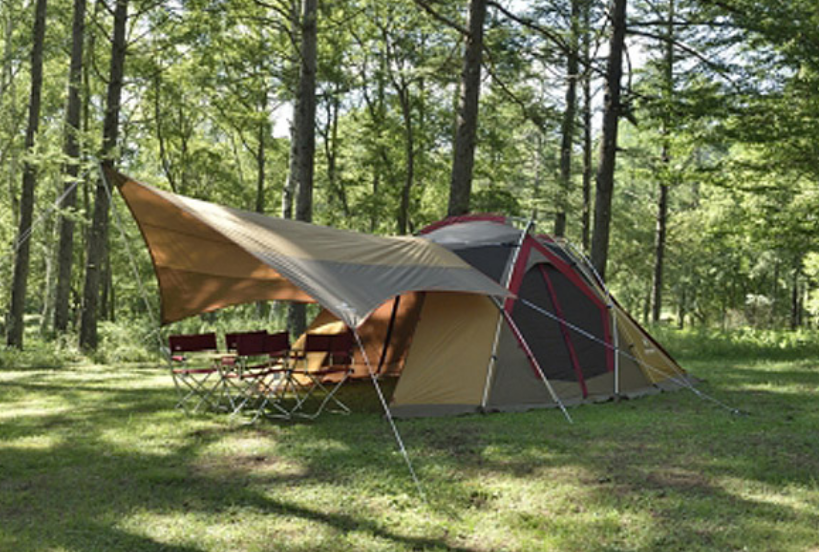

- Contents:
  - Tarp Body
  - Stopper Y-Type Rope (x1)
  - Stopper Rope (x4)
  - Frame Mounting Stopper Rope (x2)
  - Carry Bag
  - Pole Case
  - Stake Case
  - User Guide
- Materials: Body: 210D Polyester Oxford, Light-Blocking Pigment PU Coating, Hydrostatic Head 3,000mm min., Teflon Water-Repellent, UV Protection
- Bag Size: W80 x D20 x H20mm
- Weight: 2.8kg
- Color: Beige x Gray

### Low Chair Cushion (FES-125)

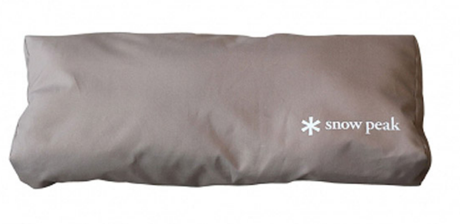

- Materials: Fabric: Polyester
- Size: 53 x 23 x 10cm
- Weight: 220g

### Hozuki Luminous Shade (UG-275)

- Materials: Silicone Rubber

### IGT Tissue Hanger Set (FES-006)

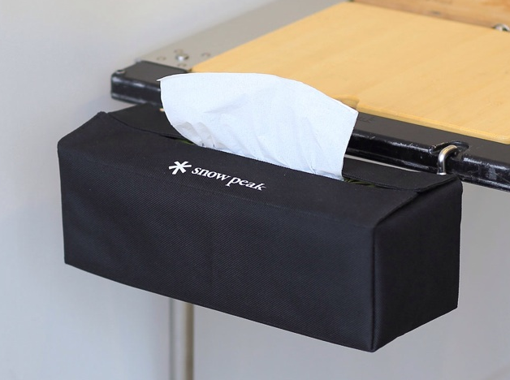

- Contents:
  - Stainless Box Hanger x1
  - Tissue Case x1
  - Rail Joint Hardware x2
- Materials:
  - Stainless Box Hanger: Stainless Steel
  - Tissue Case: 100% Polyester Fabric
  - Cushion: EPE
  - Rail Joint Handle: Aluminum Alloy
- Size: W345 x D150 x H135 (when in use) Weight: 550g Stainless Box Hanger
- Load Capacity: 10kg (when set on IGT frame)

### Asterisk Cookie Cutter (UG-050)

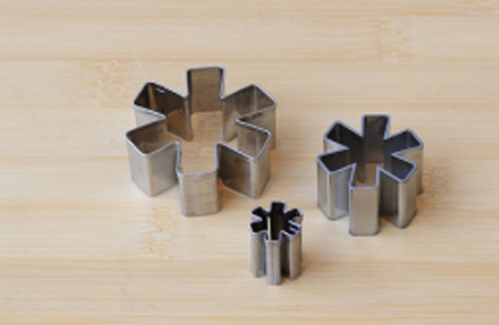

- Materials:
  - Body: Stainless Steel
  - Carrying Case (fabric): 100% Cotton
  - Carrying Case (cord): 100% Polypropylene
- Body Packed Size: W45 x D45 x H19mm

### Snow Peak X Nalgene Water Bottle (FES-120GY/BL/CL)

- Weight: approx. 180g
- Materials:
  - Body: Saturated Polyester Resin
  - Lid: Polypropylene

## 2014 Spring

### IGT Two-Unit Frame Black (CK-170BK)

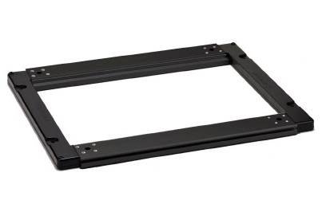

* Size: W596 x D496 x H30mm
* Weight: 3.4kg
* Materials: Aluminum

### IGT Three-Unit Frame Black (CK-149BK)

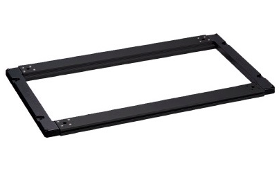

* Size: W846 x D496 x H30mm
* Weight: 4.1kg
* Materials: Aluminum

### IGT Four-Unit Frame Black (CK-150BK)

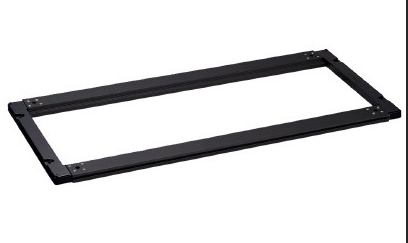

* Size: W1,096 x D496 x H30mm
* Weight: 4.8kg
* Materials: Aluminum

### Carrying Belt (FES-117)

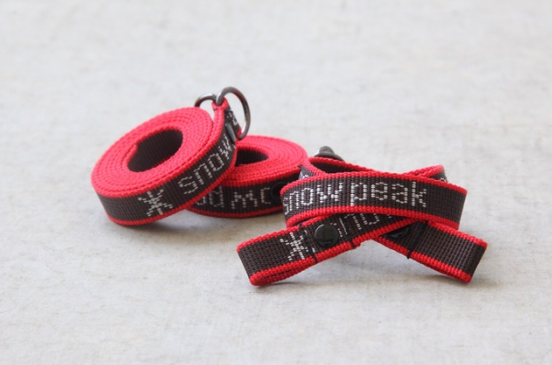

- Size:
  - Connection Belt: width 15mm x 1000mm
  - Handle: width 15mm x 450mm
- Set Weight: 50g
- Materials:
  - Belt: Polypropylene
  - D-Ring: Steel

### Noren Snow Crystal (FES-040)

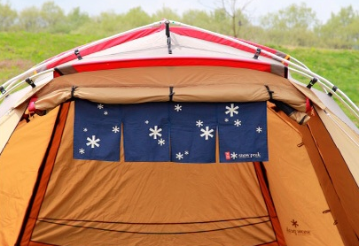

- Size: 116 x 41cm
- Materials:
  - Body: 100% Cotton
  - Acrylic Tape
- Compatible Shelters:
  - Land Lock
  - Living Shell (attach to panel toggle) ※ Tortue
  - Tortue Light
  - Mesh Shelter requires a commercially available curtain rod or rope.

### Noren Tool Box (FES-041)

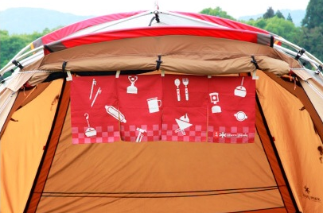

- Size: 116 x 41cm
- Materials:
  - Body: 100% Cotton
  - Acrylic Tape
- Compatible Shelters:
  - Land Lock
  - Living Shell (attach to panel toggle) ※ Tortue
  - Tortue Light
  - Mesh Shelter requires a commercially available curtain rod or rope.

### Mini Hozuki Blue (ES-040BL)

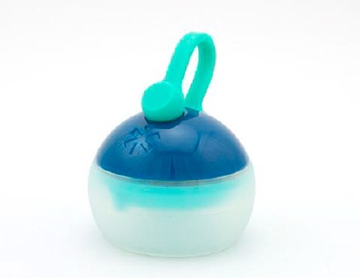

- Size: Φ62 x 75mm
- Weight: 57g (excl. battery)
- Materials:
  - Polycarbonate Resin
  - ABS Resin
  - Silicone Rubber
- Operating Temp: 0–35°C
- Battery Type: AAA Alkaline Battery (LR03) x3
- Continuous Use Time: Hi mode 40 hrs / Low mode 70 hrs
- Brightness: 60 lumen
- Light Color: Warm White

### Mini Hozuki Green (ES-040GR)

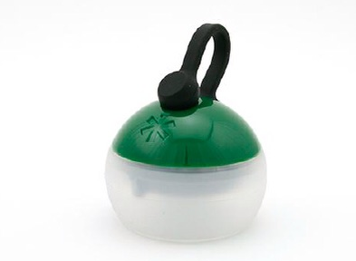

- Size: Φ62 x 75mm
- Weight: 57g (excl. battery)
- Materials:
  - Polycarbonate Resin
  - ABS Resin
  - Silicone Rubber
- Operating Temp: 0–35°C
- Battery Type: AAA Alkaline Battery (LR03) x3
- Continuous Use Time: Hi mode 40 hrs / Low mode 70 hrs
- Brightness: 60 lumen
- Light Color: Warm White

### Cup Marker (CM-001LP,LB,GR,YL,PK)

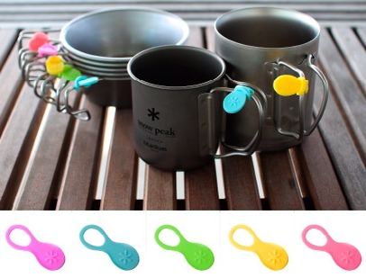

* Size: W15 x D40 x H5mm
* Materials: Silicone Rubber

## 2013 Fall

### HD Tarp Shield Recta L Gray (FES-110)

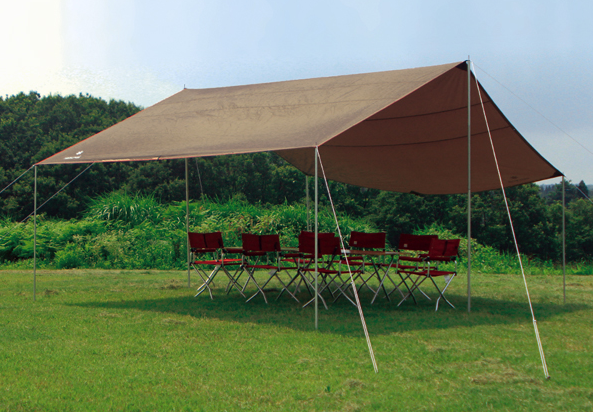

- Set Contents:
  - Tarpaulin Body
  - Stopper Rope (Y-type 10m x2, 3m x4)
  - Pole Case
  - Stake Case
  - Carrying Case
  - User Guide
- Materials: 210D Polyester Oxford, Blackout Pigment PU Coating, Hydrostatic Head 3,000mm min., UV Protection, Teflon Water-Repellent (Initial Water Repellency 100, 90 after 5 washes)
- Case Size: W80cm x D17cm x H22cm
- Weight: 5.0kg (incl. body, rope, etc.)
- Color: Gray

### HD Tarp Shield Wing Gray (FES-111)

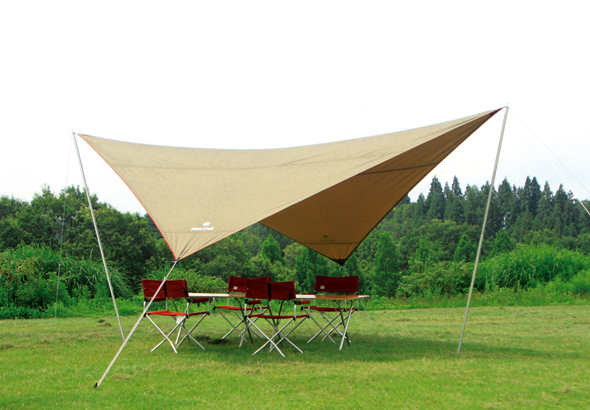

- Set Contents:
  - Tarpaulin Body
  - Stopper Rope (Y-type 10m x2, 3m x2)
  - Pole Case
  - Stake Case
  - Storage Case
  - User Guide
- Materials: 210D Polyester Oxford, Blackout Pigment PU Coating, Hydrostatic Head 3,000mm min., UV Protection, Teflon Water-Repellent (Initial Water Repellency 100, 90 after 5 washes)
- Storage Case Size: W80cm x D17cm x H22cm
- Weight: 4.0kg (incl. body, rope, etc.)
- Color: Gray

### Land Station L Plus (FES-112)

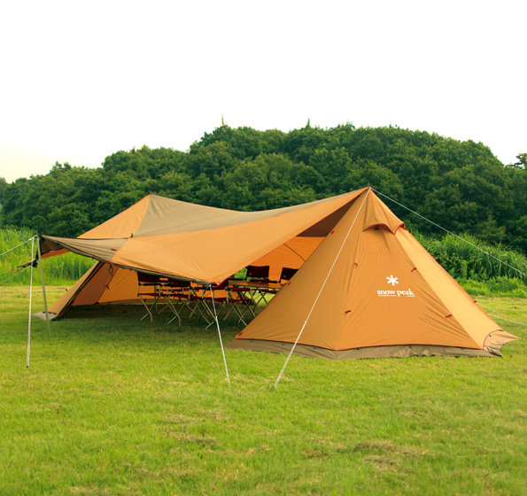

- Set Contents:
  - Tarpaulin Body
  - Stopper Y-Type Rope (9m x2, 7m x2)
  - Stopper Rope (x4)
  - Pole Case
  - Stake Case
  - Carrying Case
  - User Guide
- Materials: 150D Polyester Oxford, Blackout Pigment PU Coating, Hydrostatic Head 3,000mm min. (gray section), Teflon Water-Repellent (Initial Water Repellency 100, 90 after 5 washes), UV Protection
- Case Size: W76cm x D28cm x H33cm
- Weight: 12.0kg (incl. body, rope, etc.)
- Color: Beige x Gray

### Peg Hammer Pro. C Chrome (FES-113)

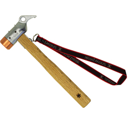

- Materials: Head: Steel (Chrome Plating)
- Size: Φ35 x 120 x 290mm
- Weight: 670g

### Dog Anchor 50 (FES-114)

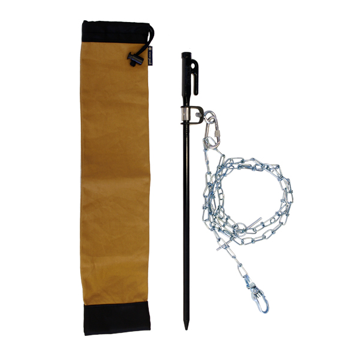

- Materials:
  - Body: Stainless Steel
  - Snap Hook: Stainless Steel
  - Dog Chain: Iron
  - Carrying Case: No.11 Canvas, Nylon, Faux Leather
- Body Size (excl. Dog Chain):
  - 50 x 7 x 2cm
  - Dog Chain Length: 1.6m
- Weight: 0.9kg (incl. carrying case)

## 2013 Spring

### Solid State Lantern Mini Hozuki Black (ES-040BK)

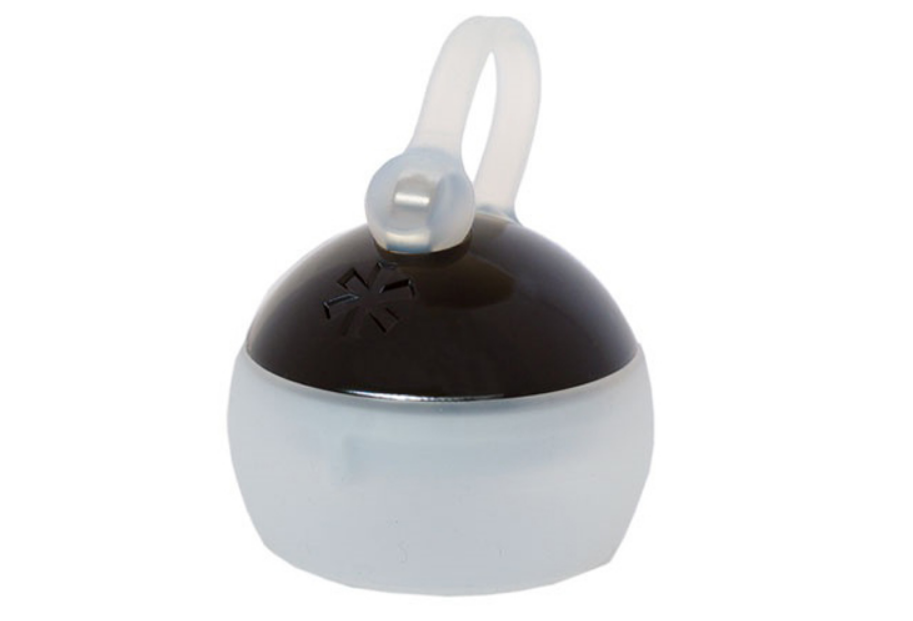

* Contents: Mini Hozuki Body (x1), Test Alkaline Battery (x3)
* Materials: ABS Resin, Silicone
* Operating Temp: 0–35°C
* Battery: AAA Alkaline Battery x3
* Continuous Light Time: Hi-40hrs / Low-70hrs
* Brightness: 60lm (ANSI)
* Light Color: Natural White
* Size: Φ62mm x H75mm
* Weight: 57g (excl. battery)

### Stainless Wine Tumbler (FES-150)

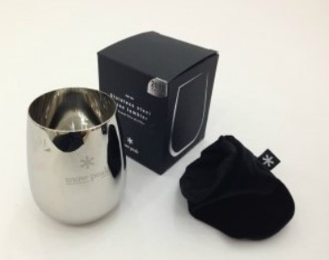

- Materials:
  - Body: Stainless Steel
  - Case (top): 65% Polyester, 35% Rayon
  - Case (bottom): 90% Polyester, 10% Polyurethane
- Size: (narrow) Φ61.5mm x (wide) Φ80mm x H100mm
- Capacity: 410ml
- Weight: 180g

### Furoshiki Blackout (FES-152)

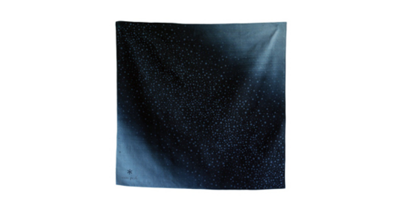

- Size: 880 x 880mm
- Materials: 100% Cotton

### Furoshiki Whiteout (FES-151)

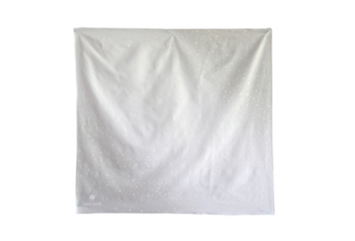

- Size: 880 x 880mm
- Materials: 100% Cotton

### Asterisk Sticker Set Luminous (FES-093)

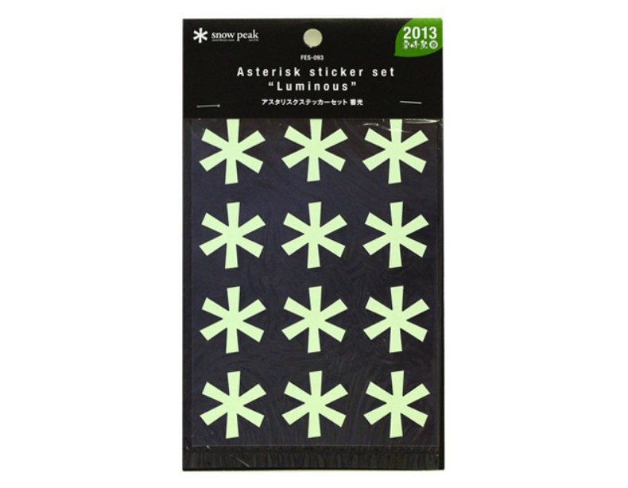

- 12 pcs / 1 sheet

### Asterisk Sticker Set Reflective (FES-094)

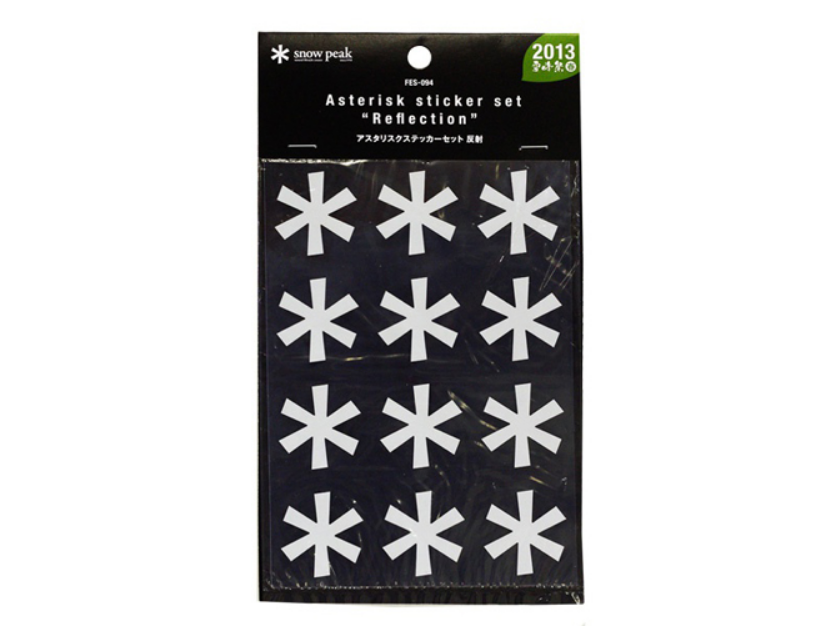

- 12 pcs / 1 sheet

### Asterisk Stopper Black 12pcs (FES-097)

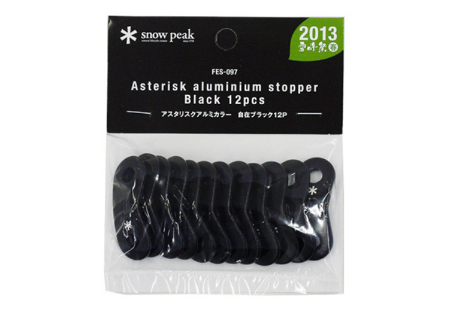

- Materials: Aluminum (Anodized)
- Size: 16 x 39 x 7mm / 12 pcs
- Weight: 2.8g
- Compatible Rope Diameter: 4mm rope

### Asterisk Stopper Gold 12pcs (FES-096)

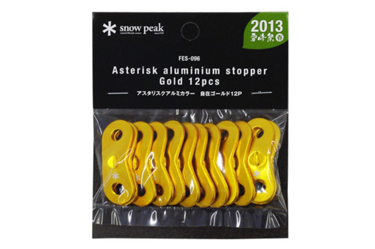

- Materials: Aluminum (Anodized)
- Size: 16 x 39 x 7mm / 12 pcs
- Weight: 2.8g
- Compatible Rope Diameter: 4mm rope

### Black Multi Container L (FES-078)

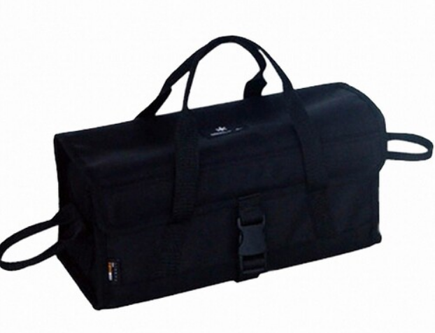

- Materials:
  - Cordura Nylon 1680D
  - Polyester 1680D
  - Nylon Mesh
  - Resin Board
  - PP Belt
  - Plastic
- Size: W540 x H160 x D180mm
- Weight: approx. 900g *No related data available for Japan FES

### Black Multi Container M (FES-077)

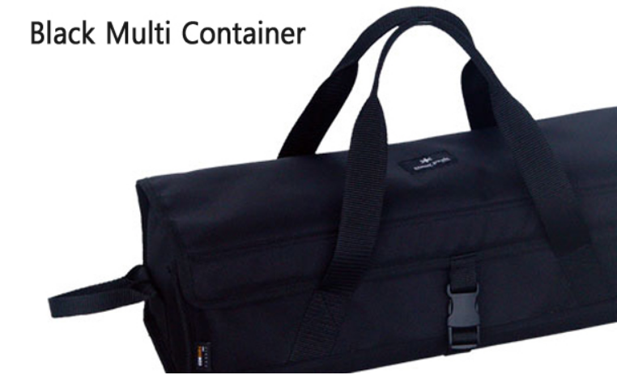

- Materials:
  - Cordura Nylon 1680D
  - Polyester 1680D
  - Nylon Mesh
  - Resin Board
  - PP Belt
  - Plastic
- Size: W440 x H150 x D160mm
- Weight: approx. 700g *No related data available for Japan FES

### Black Multi Container S (FES-076)

- Materials:
  - Cordura Nylon 1680D
  - Polyester 1680D
  - Nylon Mesh
  - Resin Board
  - PP Belt
  - Plastic
- Size: W340 x H150 x D140mm
- Weight: approx. 500g *No related data available for Japan FES

### Black Tote Bag M (FES-065)

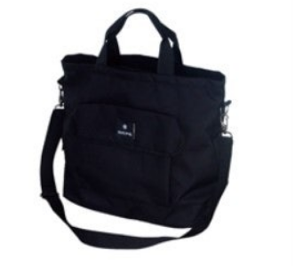

- Materials:
  - Cordura Nylon 1680D
  - Polyester 1680D
  - Nylon Mesh
  - PP Belt
- Size: W400 x H450 x D220mm
- Weight: approx. 600g *No related data available for Japan FES

### Black Tote Bag S (FES-064)

- Materials:
  - Cordura Nylon 1680D
  - Polyester 1680D
  - Nylon Mesh
  - PP Belt
- Size: W360 x H380 x D250mm
- Weight: approx. 600g *No related data available for Japan FES

## 2012 Fall

### Porcelain Cup Black & White Set (FES-082)

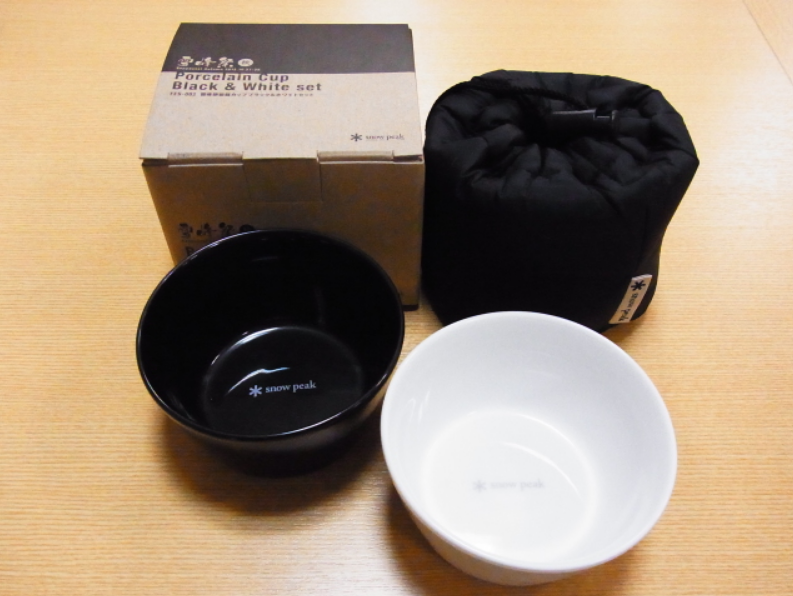

- Capacity: 300ml
- Weight: 200g
- Size: Φ106mm x 58mm
- Contents:
  - Soft Pouch
  - Cup (x2)

### Porcelain Cup Black (FES-081)

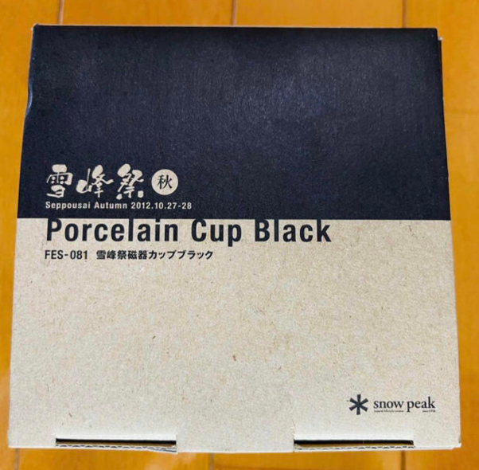

- Capacity: 300ml
- Weight: 200g
- Size: Φ106mm x 58mm
- Contents:
  - Soft Pouch
  - Cup (x1)

### Porcelain Cup White (FES-080)

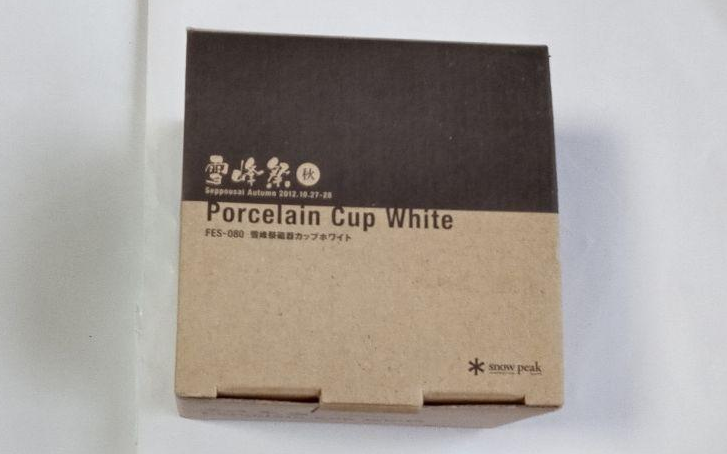

- Capacity: 300ml
- Weight: 200g
- Size: Φ106mm x 58mm
- Contents:
  - Soft Pouch
  - Cup (x1)

### Snow Peak Logo Sticker Set (FES-083)

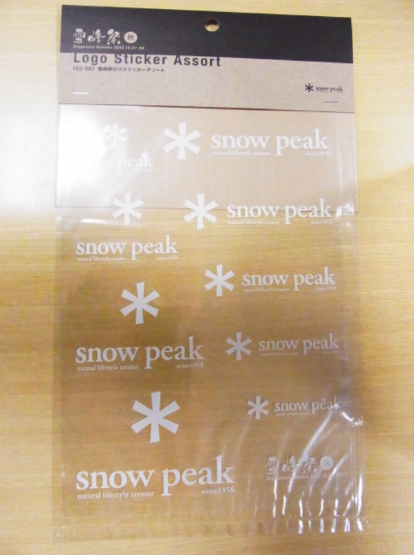

### 100cc Porcelain Cup (FES-060)

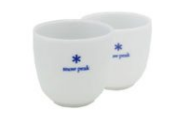

- Materials:
  - White Porcelain
  - Case: Nylon
- Size: Φ60 x 60mm
- Capacity: 100cc

### Kitchen Paper Holder (FES-063)

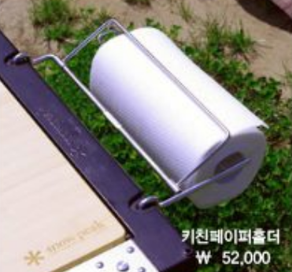

### FES Mark H300 Glossy Titanium (FES-061)

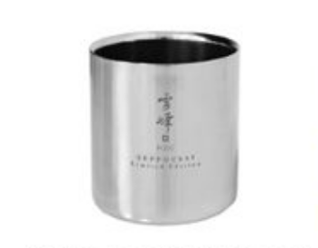

- Size: Φ76 x 86mm
- Capacity: 300ml
- Materials: Body: Titanium
- Size: 148 x 210 x 6mm (1 volume)
- Materials:
  - Cover: Cardstock
  - Humming Paper

### FES A5 Catalog Notebook Set

A set of 3 A5-size notebooks styled after the Snow Peak catalog cover. 160 pages each for plenty of use.
* Size: 148 x 210 x 6mm (per notebook)
* Materials: Cover/Cardstock, Humming Paper

## 2011

### Take! Silver Pendant Necklace (FES-057)

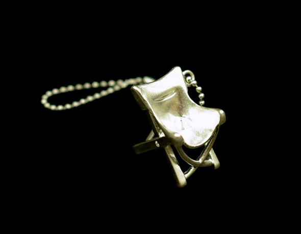

- Body Size: W16mm x D17mm x D14mm
- Body Material:
  - Brass
  - Silver Plated
- Body Weight: 6g

### Brazier Silver Pendant Necklace (FES-058)

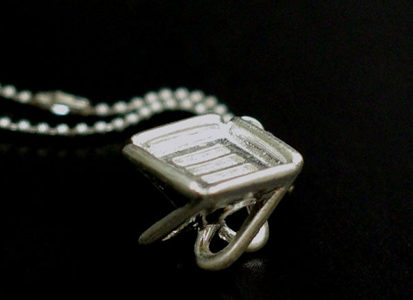

- Body Size: W16mm x D14mm x D11mm
- Body Material:
  - Brass
  - Silver Plated
- Body Weight: 4g

### Dutch Oven Silver Pendant Necklace (FES-059)

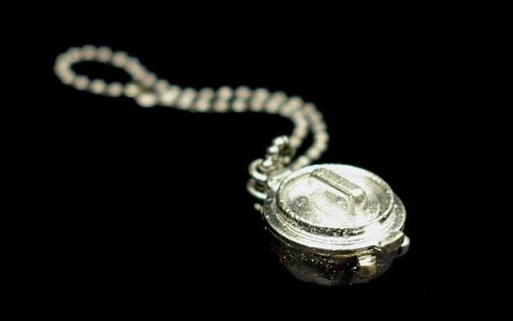

- Body Size: W19mm x D14mm x D11mm
- Body Material:
  - Brass
  - Silver Plated
- Body Weight: 7g

### 2011 Snow Peak Store Thanksgiving Limited Item Trash Bag Small Red (FES-060RD)

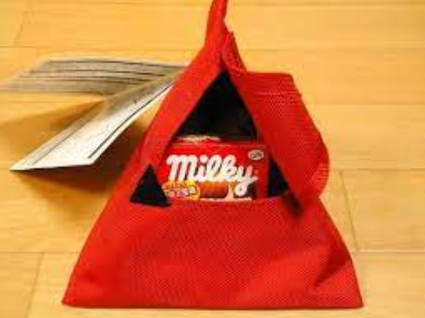

- Color: RED
- Materials: 1,680D Polyester
- Size: W195 x D200 x H175mm
- When Stored: W195 x D200mm
- Weight: 40g

### 2011 Snow Peak Store Thanksgiving Limited Item Trash Bag Small Dark Blue (FES-060DB)

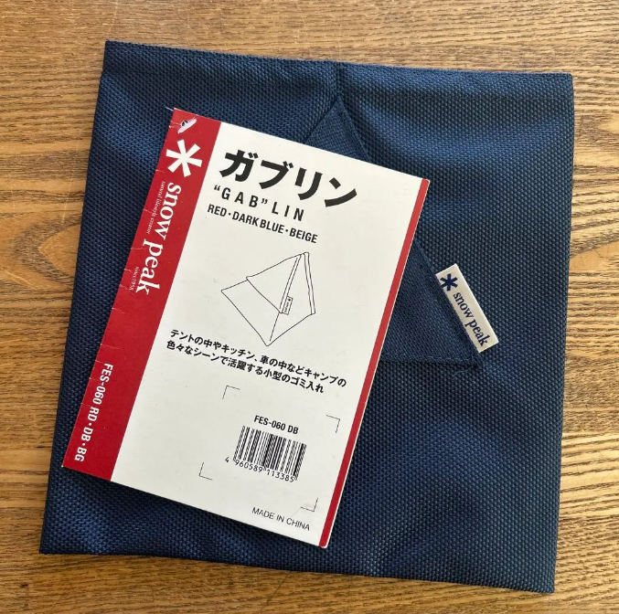

- Color: DARK BLUE
- Materials: 1,680D Polyester
- Size: W195 x D200 x H175mm
- When Stored: W195 x D200mm
- Weight: 40g

### 2011 Snow Peak Store Thanksgiving Limited Item Trash Bag Small Beige (FES-060BG)

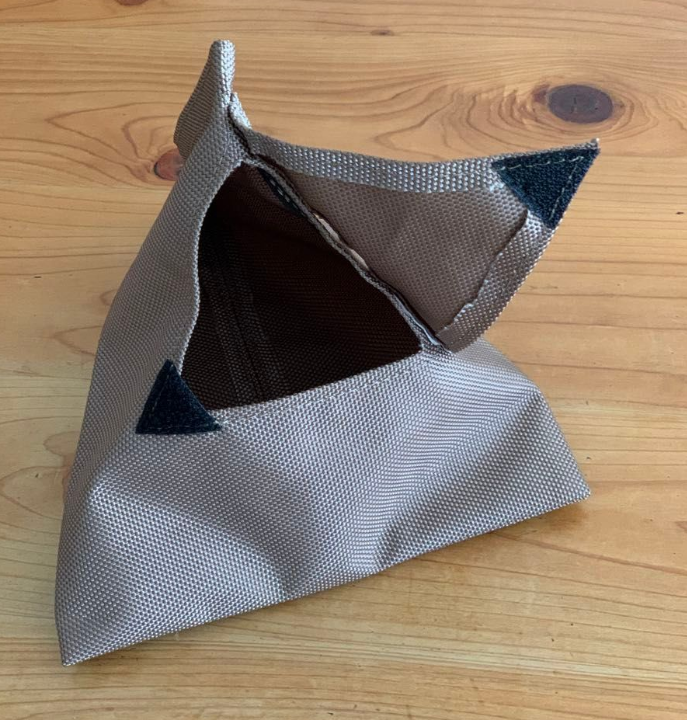

- Color: BEIGE
- Materials: 1,680D Polyester
- Size: W195 x D200 x H175mm
- When Stored: W195 x D200mm
- Weight: 40g

## 2010

### Snow Peak Logo Sticker Silver L (FES-034)

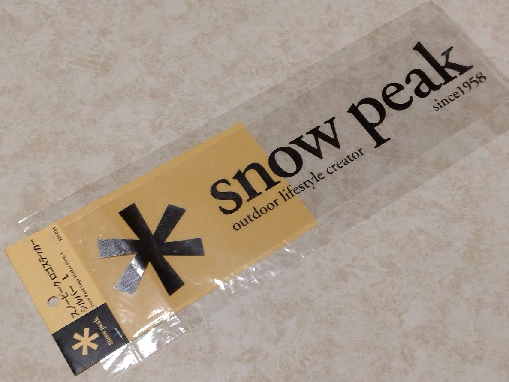

- Size: 350 x 80mm (when attached)

### Gear Container Box Orange (FES-032 OR)

### Micro Camera Mount (FES-033)

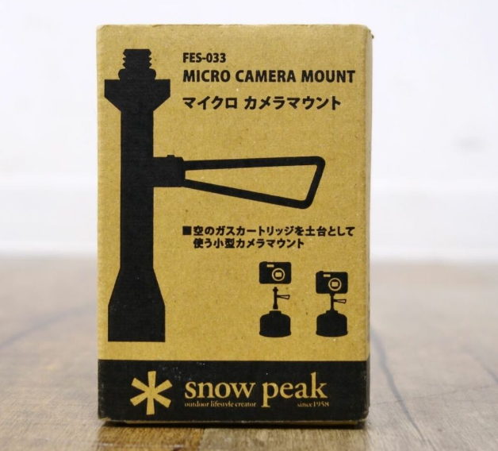

- Materials:
  - Body: Stainless Steel
  - O-Ring: NBR (Nitrile Rubber)
- Weight: Body: 31g
- Packed Size: W15 x D15 x H65mm

### Light Tarp Ponta L Shield Pro (FES-031)

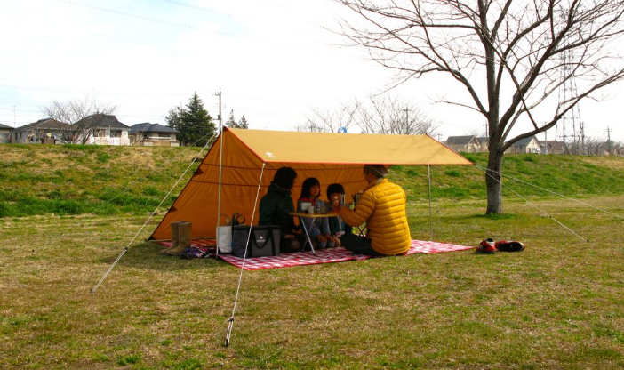

- Materials: Body: 75D Polyester Ripstop, Light-Blocking Pigment PU Coating, Hydrostatic Head 3,000mm min., UV Protection, Teflon Water-Repellent
- Size: W330 x D255cm Case Size: W150 x D350 x H100mm

### Land Station L Pro (FES-030)

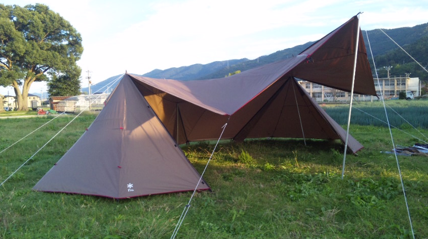

### Snow Peak Logo Sticker Silver S (FES-035)

## 2009

### Tenugui Yukimine (FES-025)

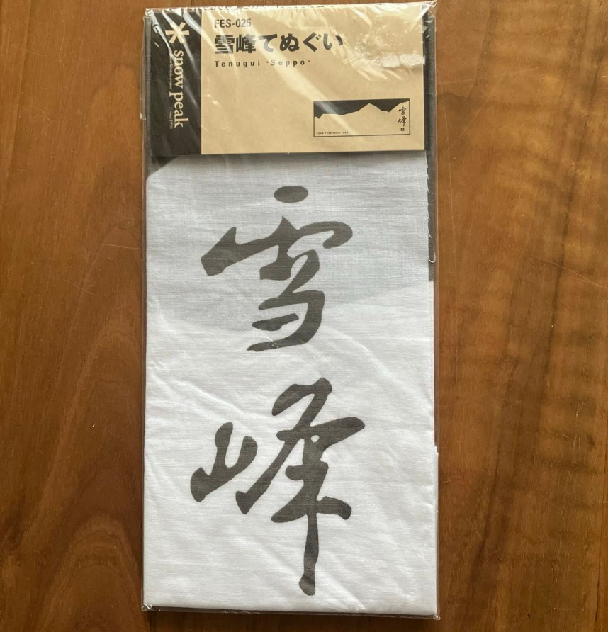

- Size: W890 x D360mm

### Festival Sticker (FES-026)

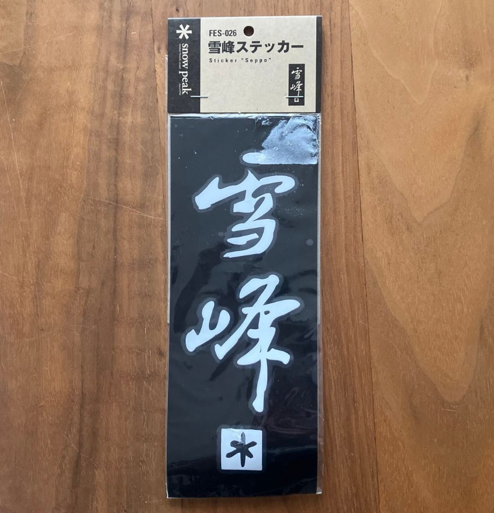

- Size: W59 x H164mm (when attached)

### Wabuki Chopsticks Ebony (FES-020)

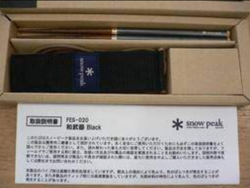

- Body Size: 48 x 214mm (approx. 118mm when stored)
- Materials:
  - Handle: Stainless Steel
  - Tip: Aodamo (Urushi Lacquer)
  - Joint, Lid: Brass
  - Rubber
  - Case: Polypropylene
- Case Size: 38 x 140mm
- Weight:
  - Body: 28g
  - Case: 13g

### Backpacker's Cup Stainless Black (FES-021)

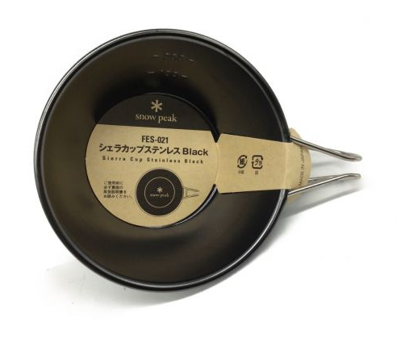

- Materials: Stainless Steel
- Size: 120 x H45mm (excl. handle)
- Weight: 100g

### Stainless Candle Holder (FES-023)

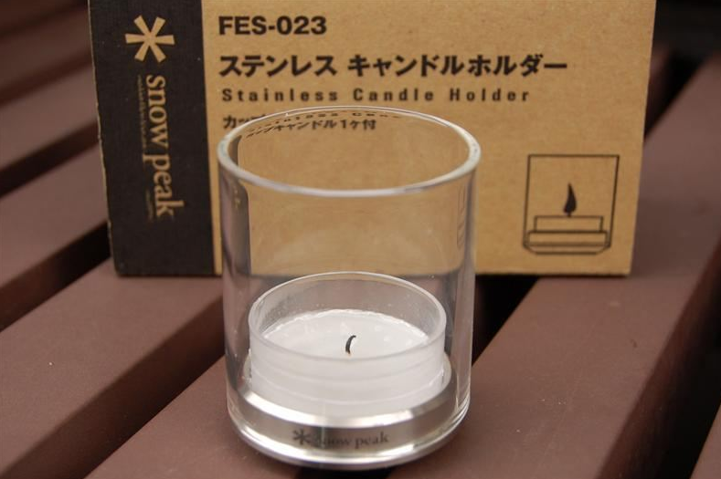

- Materials:
  - Base: Stainless Steel
  - Globe: Heat-Resistant Glass
  - Candle: Polycarbonate, Paraffin
- Size:
  - Body: 450 x H63mm
  - Cup Candle: 440 x H22mm
- Weight: 110g (excl. candle)

### Stainless Spork Black (FES-022)

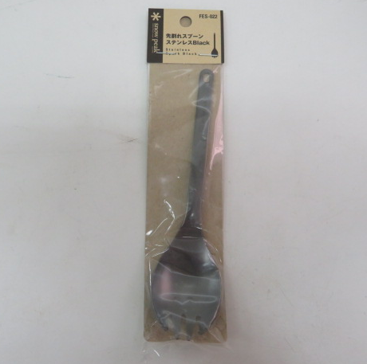

- Materials: Stainless Steel
- Size: W40 x H165mm
- Weight: 28g

## 2008

### Bamboo Coaster (FES-012)

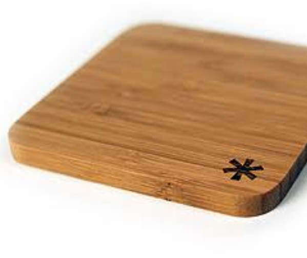

Square bamboo coaster, Asterisk mark version

### Bamboo Desk Clock (FES-013)

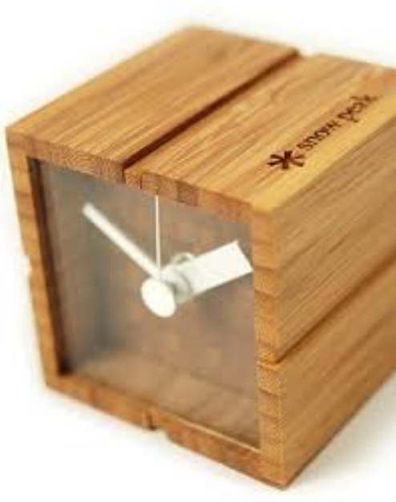

Small desk clock, approximately paper cup size

### Leather Mouse Pad (FES-015)

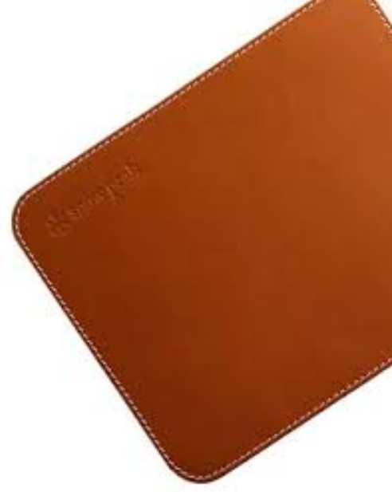

Brown leather mouse pad 50th Anniversary Titanium Single Mug 450FH

### 50th Anniversary Titanium Single Mug 450FH (FES-017)

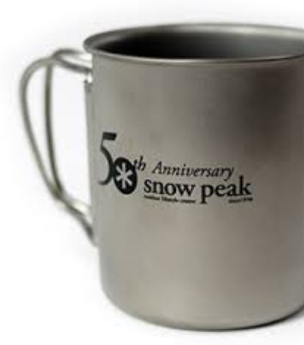

Single mug 450FH with 50th anniversary commemorative logo

### 50th Anniversary Titanium Single Mug 300FH (FES-018)

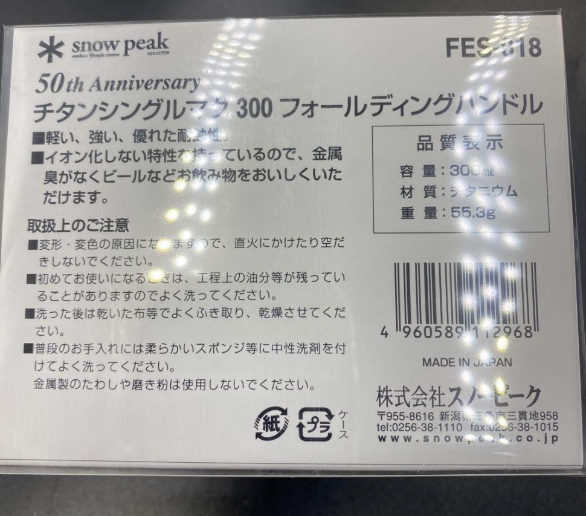

Single mug 300FH with 50th anniversary commemorative logo 50th Anniversary Logo Sticker

### 50th Anniversary Logo Sticker (FES-014)

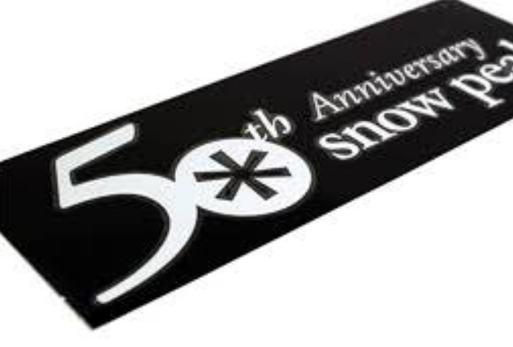

Vehicle sticker featuring 50th anniversary commemorative logo

## 2007

### Pocketable Tote Bag (FES-008)

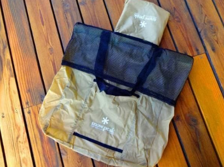

Made from tent fabric; unfolds into a tote bag, and folds inside-out into a small pocket for compact storage (Beige)

- Materials:
  - 210D Polyester (Reverse PU Processing)
  - Polyester Mesh
- Size:
  - In use: 340 x 120 x 410(h)mm
  - When stored: 140 x 170 x 50mm
- Weight: approx. 150g

### Pocketable Duffel Bag (FES-009)

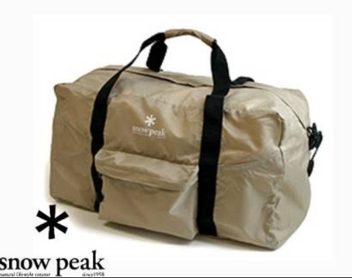

Made from tent fabric; unfolds into a duffel bag, and folds inside-out into a small pocket for compact storage (Beige). Great as an eco bag or everyday bag, from daily life to outdoor use. A must-have for camping and shopping. Shoulder strap included.

- Materials: 210D Polyester Ripstop
- Size: 300 x 560 x 300mm
- Color: Beige (BG)

### Tissue Box Case (FES-010)

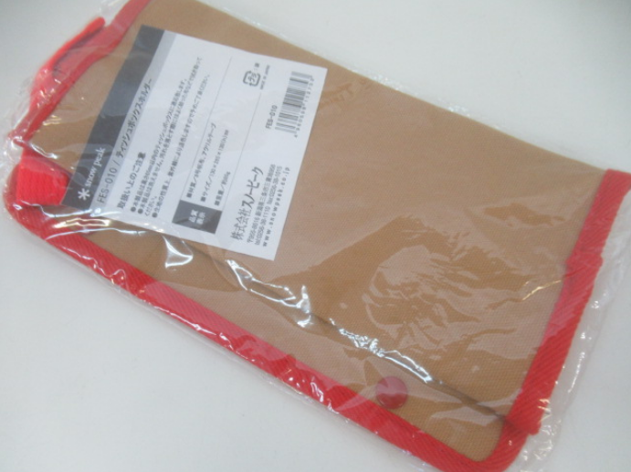

Tissue case for box tissues, made of beige canvas. Fits standard slim-type box tissues commonly found in Japan.
